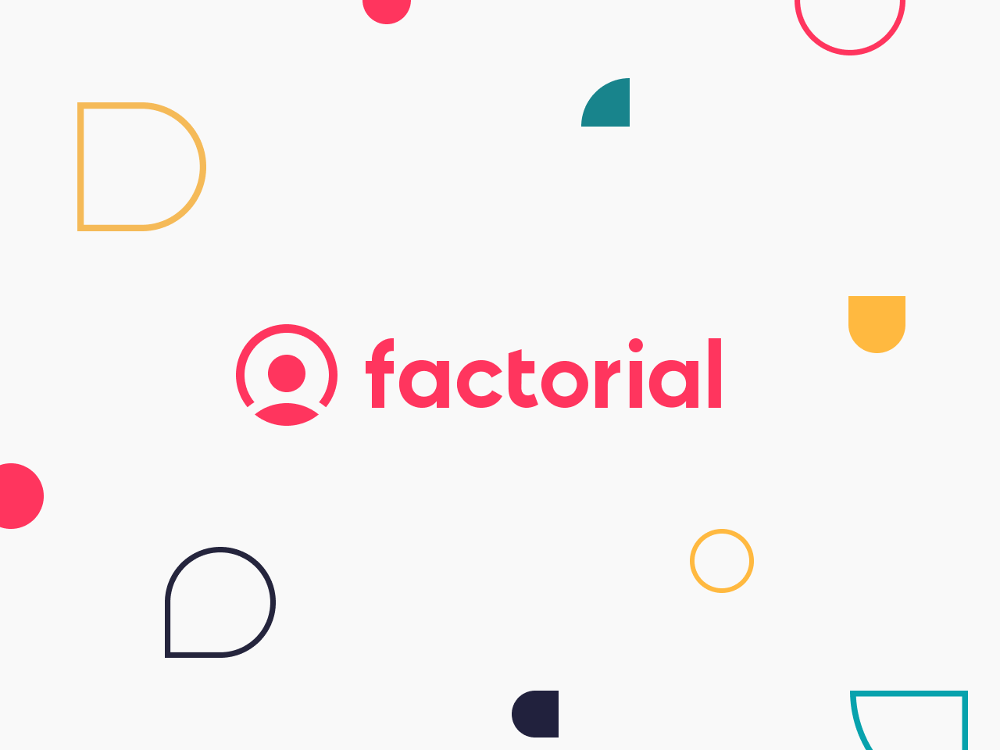

<div align="left">

[](https://factorialhr.com)

# [Factorial](https://factorialhr.com)<a id="factorial"></a>

Open Api Specifications available at [https://github.com/factorialco/oas](https://github.com/factorialco/oasLooking)

Guides and support available at [https://help.factorialhr.com/integrations](https://help.factorialhr.com/integrations)

# Authentication<a id="authentication"></a>

The public API provides two methods of authentication, ApiKeys and OAuth2. The following sections provide information regarding each one and their intent.

## OAuth2<a id="oauth2"></a>

> OAuth2 is used to identify individual users, not applications or platforms.

OAuth2 is available for authenticating to the public API and making requests via third parties **on behalf of a user**. All actions are authored on behalf of the user that creates the token. This means the intent is to be used mainly to do submit actions the actual user is performing on an alternative interface.

To generate a token you will require opening an authorization dialog that returns a code, this code can then be exchanged for a token.

### Configuration<a id="configuration"></a>

In order to create an OAuth application, you must be an admin, head over to your [personal repository of OAuth applications](https://api.factorialhr.com/oauth/applications), click on `New application` and follow the creation process.

The Factorial API enforces the same permissions at the user level than the Factorial web application. This means that Factorial API users will only be able to perform the same actions they are allowed to do in the Factorial platform.

Next step will be to generate the Authorization Code you will need in order to generate an OAuth2 Token.

### OAuth2 Code Generation<a id="oauth2-code-generation"></a>

Should be generated via browser by opening the following url. The user should be already logged in to Factorial beforehand.

`https://api.factorialhr.com/oauth/authorize?client_id=&redirect_uri=&response_type=code&scope=`

YOUR_CLIENT_ID: OAuth2 Application Id
REDIRECT_URI: OAuth2 Redirect URL

#### State Parameter<a id="state-parameter"></a>

An optional query parameter called `state` can be added to the code generation url. Any string can be used and will be sent on the callback url.

> Authorization protocols provide a `state` parameter that allows you to restore the previous state of your application. The `state` parameter preserves some state objects set by the client in the Authorization request and makes it available to the client in the response.

### OAuth2 Token Generation<a id="oauth2-token-generation"></a>

Once you have the authorization code, you can request their access token to Factorial.

`curl -X POST 'https://api.factorialhr.com/oauth/token' -d 'client_id=&client_secret=&code=&grant_type=authorization_code&redirect_uri='`

YOUR_CLIENT_ID: OAuth2 Application Id
YOUR_CLIENT_SECRET: OAuth2 Application Secret
AUTHORIZATION_CODE: OAuth2 CODE
REDIRECT_URI: OAuth2 Redirect URL

> You can generate only one OAuth2 token per Code, that means that if you want to generate a new token for a Code that already have one you should refresh your token.

Every time a new token is generated a refresh token is generated as well, so that you can use it on the OAuth2 Refresh Token, and an expire date is also provided.

### OAuth2 Refresh Token<a id="oauth2-refresh-token"></a>

You can generate a new token under the same Code with a new expire date (you can do it as many times as you need). A refresh token is also returned here so that you can use it on the OAuth2 Refresh Token again.

`curl -X POST 'https://api.factorialhr.com/oauth/token' -d 'client_id=&client_secret=&refresh_token=&grant_type=refresh_token'`

YOUR_CLIENT_ID: OAuth2 Application Id
YOUR_CLIENT_SECRET: OAuth2 Application Secret
REFRESH_TOKEN: OAuth2 Refresh Token

### OAuth2 Revoke Token<a id="oauth2-revoke-token"></a>

You can revoke an access/refresh token if you do not want it to be active anylonger. This can happen in cases where you have refreshed your token and would like to revoke the previous token if you haven't used the new token yet, as using the new token automatically revokes the previous one.

`curl -X POST 'https://api.factorialhr.com/oauth/revoke' -d 'client_id=&client_secret=&token='`

YOUR_CLIENT_ID: OAuth2 Application Id
YOUR_CLIENT_SECRET: OAuth2 Application Secret
TOKEN: OAuth2 Access/Refresh Token (whichever you wish to revoke)

### OAuth2 Token Usage<a id="oauth2-token-usage"></a>

The generated token is the credential for performing authenticated requests to Factorial. This token should be included in the Authorization header prefixed with the word Bearer and a separating space.
As an example, if your token is `12345` then the header content should be `Bearer 12345`.

### Maintaining a persistent connection<a id="maintaining-a-persistent-connection"></a>

To maintain a persistent connection, you should not let the token expire. You can avoid this by simply refreshing your token before the expiration date. This will give you another token with a new expiration date, before that token expires you should refresh it again, and so on...
If you want to do this automatically, you should provide something in your code that will help you perform the update every time the token expires. Otherwise, you would have to do the update manually and make sure you refresh your token before the expiration date to maintain the connection.

## ApiKeys<a id="apikeys"></a>

> API keys are used to identify systems, not the individual users that access.

ApiKeys have **TOTAL ACCESS** to everything and never expire. Its the creators responsibility to generate them and store them securely.

### Generation<a id="generation"></a>

In the `Core>Keys` section of this documentation you can access the apis for managing this resource.

### Usage<a id="usage"></a>

ApiKeys are a single string of symbols that must be added as a custom header on the request. The header name must be `x-api-key` and the key must be the value without any prefixes.

### Disclaimer<a id="disclaimer"></a>

ApiKey management require full admin permissions as the resource itself allows for full admin access to the entire platform on behalf of the company and not of a user, therefore any operations are not linked to any user in particular.

# Development<a id="development"></a>

## SDKs<a id="sdks"></a>

Coming soon

## Sandbox<a id="sandbox"></a>

A sandbox/demo environment is available for testing integrations via public API calls. Developers can request provisioning with full access to a demo company where to test code before actually interacting with a production environment.

Contact your account manager or account executive to request this environment and get OAuth2 credentials for generating tokens.

Note: the domain for sandbox is different than that from production. Sandbox base domain is `http://api.demo.factorialhr.com`

## Postman<a id="postman"></a>

Click the "Run in Postman" button to open the full list of endpoints on your Postman workspace as a Postman Collection.
Inside the collection lookout for the Collection's Variables, configure your variables accordingly.

### Delegating Token Generation To Postman<a id="delegating-token-generation-to-postman"></a>

Coming soon

# Changelog<a id="changelog"></a>

Coming soon

# How to...<a id="how-to"></a>

## Custom Fields<a id="custom-fields"></a>

Custom fields are useful when you want to add some fields that are not the default ones, to every employee of the company.

For that, you have to create via Factorial App the base custom field in order to have all the employees with it. That option is available in customization, inside the company menu

Once you have that, via API, you can [Create a value for a custom field](https://apidoc.factorialhr.com/#72f3f786-e37d-4e80-ada2-0beedd03b171) to each employee. You should know the custom field id in order to make that, you can check it by [getting a collection of custom fields](https://apidoc.factorialhr.com/#f98dae5a-a8d0-474e-a181-7e9603409b42)

</div>

## Table of Contents<a id="table-of-contents"></a>

<!-- toc -->

- [Installation](#installation)
- [Getting Started](#getting-started)
- [Reference](#reference)
  * [`factorial.application.createAtsApplication`](#factorialapplicationcreateatsapplication)
  * [`factorial.application.updateData`](#factorialapplicationupdatedata)
  * [`factorial.attendance.createNew`](#factorialattendancecreatenew)
  * [`factorial.attendance.getBulkV2`](#factorialattendancegetbulkv2)
  * [`factorial.attendance.getCompanyAttendance`](#factorialattendancegetcompanyattendance)
  * [`factorial.break.createBreak`](#factorialbreakcreatebreak)
  * [`factorial.break.endBreak`](#factorialbreakendbreak)
  * [`factorial.break.startBreak`](#factorialbreakstartbreak)
  * [`factorial.candidate.createNewCandidate`](#factorialcandidatecreatenewcandidate)
  * [`factorial.candidate.deleteExistingCandidate`](#factorialcandidatedeleteexistingcandidate)
  * [`factorial.candidate.listAllCandidates`](#factorialcandidatelistallcandidates)
  * [`factorial.candidate.updateCandidateData`](#factorialcandidateupdatecandidatedata)
  * [`factorial.compensation.createContractCompensation`](#factorialcompensationcreatecontractcompensation)
  * [`factorial.compensation.deleteCompensation`](#factorialcompensationdeletecompensation)
  * [`factorial.compensation.getById`](#factorialcompensationgetbyid)
  * [`factorial.compensation.getCompensations`](#factorialcompensationgetcompensations)
  * [`factorial.compensation.updateForContract`](#factorialcompensationupdateforcontract)
  * [`factorial.contract.deleteVersion`](#factorialcontractdeleteversion)
  * [`factorial.contract.getAllReferenceContracts`](#factorialcontractgetallreferencecontracts)
  * [`factorial.contract.updateVersion`](#factorialcontractupdateversion)
  * [`factorial.contractVersion.createNewVersion`](#factorialcontractversioncreatenewversion)
  * [`factorial.contractVersion.getAllVersions`](#factorialcontractversiongetallversions)
  * [`factorial.contractVersion.getBulkVersions`](#factorialcontractversiongetbulkversions)
  * [`factorial.customField.createField`](#factorialcustomfieldcreatefield)
  * [`factorial.customField.deleteById`](#factorialcustomfielddeletebyid)
  * [`factorial.customField.getFieldsByGroup`](#factorialcustomfieldgetfieldsbygroup)
  * [`factorial.customField.getFieldsBySlug`](#factorialcustomfieldgetfieldsbyslug)
  * [`factorial.customFieldValue.createCustomValue`](#factorialcustomfieldvaluecreatecustomvalue)
  * [`factorial.customFieldValue.getBySlugName`](#factorialcustomfieldvaluegetbyslugname)
  * [`factorial.customFieldValue.getInstanceValue`](#factorialcustomfieldvaluegetinstancevalue)
  * [`factorial.customFieldValue.updateValue`](#factorialcustomfieldvalueupdatevalue)
  * [`factorial.customTable.get`](#factorialcustomtableget)
  * [`factorial.document.createNewDocument`](#factorialdocumentcreatenewdocument)
  * [`factorial.document.deleteById`](#factorialdocumentdeletebyid)
  * [`factorial.document.getById`](#factorialdocumentgetbyid)
  * [`factorial.document.listGivenEmployeeOrFolder`](#factorialdocumentlistgivenemployeeorfolder)
  * [`factorial.document.updateById`](#factorialdocumentupdatebyid)
  * [`factorial.employee.assignToTeam`](#factorialemployeeassigntoteam)
  * [`factorial.employee.changeEmail`](#factorialemployeechangeemail)
  * [`factorial.employee.createCustomTableValue`](#factorialemployeecreatecustomtablevalue)
  * [`factorial.employee.createEmployee`](#factorialemployeecreateemployee)
  * [`factorial.employee.createNew`](#factorialemployeecreatenew)
  * [`factorial.employee.getAllEmployees`](#factorialemployeegetallemployees)
  * [`factorial.employee.getBulkV2`](#factorialemployeegetbulkv2)
  * [`factorial.employee.getById`](#factorialemployeegetbyid)
  * [`factorial.employee.getByPayrollIntegrationCode`](#factorialemployeegetbypayrollintegrationcode)
  * [`factorial.employee.getCustomTableValues`](#factorialemployeegetcustomtablevalues)
  * [`factorial.employee.getEmployeeById`](#factorialemployeegetemployeebyid)
  * [`factorial.employee.getEmployees`](#factorialemployeegetemployees)
  * [`factorial.employee.listBreakConfigurationsForDates`](#factorialemployeelistbreakconfigurationsfordates)
  * [`factorial.employee.listFamilySituations`](#factorialemployeelistfamilysituations)
  * [`factorial.employee.sendInvitationEmail`](#factorialemployeesendinvitationemail)
  * [`factorial.employee.setTerminationDetails`](#factorialemployeesetterminationdetails)
  * [`factorial.employee.terminateEmployee`](#factorialemployeeterminateemployee)
  * [`factorial.employee.unassignToTeam`](#factorialemployeeunassigntoteam)
  * [`factorial.employee.unterminateEmployee`](#factorialemployeeunterminateemployee)
  * [`factorial.employee.unterminatePost`](#factorialemployeeunterminatepost)
  * [`factorial.employee.updateById`](#factorialemployeeupdatebyid)
  * [`factorial.employee.updateEmployeeById`](#factorialemployeeupdateemployeebyid)
  * [`factorial.employee.updateInTeam`](#factorialemployeeupdateinteam)
  * [`factorial.event.getTriggeredEvents`](#factorialeventgettriggeredevents)
  * [`factorial.expense.getById`](#factorialexpensegetbyid)
  * [`factorial.expense.getCompanyExpenses`](#factorialexpensegetcompanyexpenses)
  * [`factorial.familySituation.createNew`](#factorialfamilysituationcreatenew)
  * [`factorial.familySituation.updateFamilySituation`](#factorialfamilysituationupdatefamilysituation)
  * [`factorial.folder.createNewFolder`](#factorialfoldercreatenewfolder)
  * [`factorial.folder.getById`](#factorialfoldergetbyid)
  * [`factorial.folder.getByNameAndStatus`](#factorialfoldergetbynameandstatus)
  * [`factorial.folder.updateFolderById`](#factorialfolderupdatefolderbyid)
  * [`factorial.holiday.getAllCompanyHolidays`](#factorialholidaygetallcompanyholidays)
  * [`factorial.holiday.getById`](#factorialholidaygetbyid)
  * [`factorial.integration.deletePayrollCode`](#factorialintegrationdeletepayrollcode)
  * [`factorial.integration.getAllCodes`](#factorialintegrationgetallcodes)
  * [`factorial.integration.updatePayrollCode`](#factorialintegrationupdatepayrollcode)
  * [`factorial.integrationCode.createPayrollIntegrationCode`](#factorialintegrationcodecreatepayrollintegrationcode)
  * [`factorial.key.createNew`](#factorialkeycreatenew)
  * [`factorial.key.deleteById`](#factorialkeydeletebyid)
  * [`factorial.key.getCollection`](#factorialkeygetcollection)
  * [`factorial.leave.createNewLeave`](#factorialleavecreatenewleave)
  * [`factorial.leave.createNewLeave_0`](#factorialleavecreatenewleave_0)
  * [`factorial.leave.deleteById`](#factorialleavedeletebyid)
  * [`factorial.leave.deleteById_0`](#factorialleavedeletebyid_0)
  * [`factorial.leave.getById`](#factorialleavegetbyid)
  * [`factorial.leave.getById_0`](#factorialleavegetbyid_0)
  * [`factorial.leave.getCompanyLeaves`](#factorialleavegetcompanyleaves)
  * [`factorial.leave.getCompanyLeaves_0`](#factorialleavegetcompanyleaves_0)
  * [`factorial.leave.getTypes`](#factorialleavegettypes)
  * [`factorial.leave.typeCreate`](#factorialleavetypecreate)
  * [`factorial.leave.updateById`](#factorialleaveupdatebyid)
  * [`factorial.leave.updateLeaveById`](#factorialleaveupdateleavebyid)
  * [`factorial.leave.updateType`](#factorialleaveupdatetype)
  * [`factorial.legalEntity.getById`](#factoriallegalentitygetbyid)
  * [`factorial.legalEntity.listLegalEntities`](#factoriallegalentitylistlegalentities)
  * [`factorial.location.getAllLocations`](#factoriallocationgetalllocations)
  * [`factorial.location.getById`](#factoriallocationgetbyid)
  * [`factorial.location.updateShiftLocation`](#factoriallocationupdateshiftlocation)
  * [`factorial.message.createAtsMessage`](#factorialmessagecreateatsmessage)
  * [`factorial.message.getAllMessages`](#factorialmessagegetallmessages)
  * [`factorial.policy.getTimeOff`](#factorialpolicygettimeoff)
  * [`factorial.policy.getTimeOffPolicies`](#factorialpolicygettimeoffpolicies)
  * [`factorial.post.atsJobPosting`](#factorialpostatsjobposting)
  * [`factorial.post.createNewPost`](#factorialpostcreatenewpost)
  * [`factorial.post.duplicateJobPosting`](#factorialpostduplicatejobposting)
  * [`factorial.post.getAllPostings`](#factorialpostgetallpostings)
  * [`factorial.post.getById`](#factorialpostgetbyid)
  * [`factorial.post.jobPostingUpdate`](#factorialpostjobpostingupdate)
  * [`factorial.post.listPosts`](#factorialpostlistposts)
  * [`factorial.post.removeJobPosting`](#factorialpostremovejobposting)
  * [`factorial.post.removePost`](#factorialpostremovepost)
  * [`factorial.post.updateExistingPost`](#factorialpostupdateexistingpost)
  * [`factorial.shift.createClockInShift`](#factorialshiftcreateclockinshift)
  * [`factorial.shift.createNewShift`](#factorialshiftcreatenewshift)
  * [`factorial.shift.deleteById`](#factorialshiftdeletebyid)
  * [`factorial.shift.deleteShiftById`](#factorialshiftdeleteshiftbyid)
  * [`factorial.shift.getAllShifts`](#factorialshiftgetallshifts)
  * [`factorial.shift.getById`](#factorialshiftgetbyid)
  * [`factorial.shift.getFromCompany`](#factorialshiftgetfromcompany)
  * [`factorial.shift.publishShiftsInsideTimeRange`](#factorialshiftpublishshiftsinsidetimerange)
  * [`factorial.shift.toggleShiftStatus`](#factorialshifttoggleshiftstatus)
  * [`factorial.shift.updateClockOutShift`](#factorialshiftupdateclockoutshift)
  * [`factorial.shift.updateNotes`](#factorialshiftupdatenotes)
  * [`factorial.shift.updateShift`](#factorialshiftupdateshift)
  * [`factorial.supplement.createNewSupplement`](#factorialsupplementcreatenewsupplement)
  * [`factorial.supplement.deleteById`](#factorialsupplementdeletebyid)
  * [`factorial.supplement.getAll`](#factorialsupplementgetall)
  * [`factorial.supplement.updateById`](#factorialsupplementupdatebyid)
  * [`factorial.table.createCustomTable`](#factorialtablecreatecustomtable)
  * [`factorial.table.createField`](#factorialtablecreatefield)
  * [`factorial.table.getCustomTable`](#factorialtablegetcustomtable)
  * [`factorial.table.getFields`](#factorialtablegetfields)
  * [`factorial.task.addFileToTask`](#factorialtaskaddfiletotask)
  * [`factorial.task.copyById`](#factorialtaskcopybyid)
  * [`factorial.task.createNewTask`](#factorialtaskcreatenewtask)
  * [`factorial.task.deleteById`](#factorialtaskdeletebyid)
  * [`factorial.task.deleteFileInTask`](#factorialtaskdeletefileintask)
  * [`factorial.task.getAllTasks`](#factorialtaskgetalltasks)
  * [`factorial.task.getById`](#factorialtaskgetbyid)
  * [`factorial.task.getFile`](#factorialtaskgetfile)
  * [`factorial.task.getFiles`](#factorialtaskgetfiles)
  * [`factorial.task.resolveById`](#factorialtaskresolvebyid)
  * [`factorial.task.updateById`](#factorialtaskupdatebyid)
  * [`factorial.taxonomy.getById`](#factorialtaxonomygetbyid)
  * [`factorial.taxonomy.getCompanyTaxonomies`](#factorialtaxonomygetcompanytaxonomies)
  * [`factorial.team.createNewTeam`](#factorialteamcreatenewteam)
  * [`factorial.team.getAllTeams`](#factorialteamgetallteams)
  * [`factorial.team.getById`](#factorialteamgetbyid)
  * [`factorial.team.removeTeam`](#factorialteamremoveteam)
  * [`factorial.team.updateTeamById`](#factorialteamupdateteambyid)
  * [`factorial.user.infoGet`](#factorialuserinfoget)
  * [`factorial.user.subscribedWebhooksList`](#factorialusersubscribedwebhookslist)
  * [`factorial.user.subscribedWebhooksList_0`](#factorialusersubscribedwebhookslist_0)
  * [`factorial.webhook.createSubscription`](#factorialwebhookcreatesubscription)
- [Webhooks Types](#webhooks-types)
  * [`factorial.webhook.deleteWebhook`](#factorialwebhookdeletewebhook)
  * [`factorial.webhook.deleteWebhookById`](#factorialwebhookdeletewebhookbyid)
  * [`factorial.webhook.subscriptionCreate`](#factorialwebhooksubscriptioncreate)
- [Webhooks Types](#webhooks-types-1)
  * [`factorial.webhook.updateWebhookById`](#factorialwebhookupdatewebhookbyid)
  * [`factorial.workplace.createNewWorkplace`](#factorialworkplacecreatenewworkplace)
  * [`factorial.workplace.getById`](#factorialworkplacegetbyid)
  * [`factorial.workplace.listAllWorkplaces`](#factorialworkplacelistallworkplaces)
  * [`factorial.workplace.removeWorkplace`](#factorialworkplaceremoveworkplace)
  * [`factorial.workplace.updateWorkplaceById`](#factorialworkplaceupdateworkplacebyid)

<!-- tocstop -->

## Installation<a id="installation"></a>
<div align="center">
  <a href="https://konfigthis.com/sdk-sign-up?company=Factorial&language=TypeScript">
    
  </a>
</div>

## Getting Started<a id="getting-started"></a>

```typescript
import { Factorial } from "factorial-typescript-sdk";

const factorial = new Factorial({
  // Defining the base path is optional and defaults to https://api.factorialhr.com/api
  // basePath: "https://api.factorialhr.com/api",
  apiKey: "API_KEY",
});

const createAtsApplicationResponse =
  await factorial.application.createAtsApplication({
    ats_job_posting_id: 1,
    source: "indeed",
    medium: "LinkedIn",
    ats_candidate_id: 2,
    cover_letter: "",
    first_name: "Bob",
    last_name: "Stone",
    phone: "1134124214",
    email: "bob_stone@factorial.co",
    cv: "cv.pdf",
    photo: "photo.jpg",
    answers: [
      {
        ats_question_id: 1,
        value: "string_example",
      },
      ,
    ],
  });

console.log(createAtsApplicationResponse);
```

## Reference<a id="reference"></a>


### `factorial.application.createAtsApplication`<a id="factorialapplicationcreateatsapplication"></a>

This endpoint allows a consumer to create and store Ats Applications in Factorial

#### 🛠️ Usage<a id="🛠️-usage"></a>

```typescript
const createAtsApplicationResponse =
  await factorial.application.createAtsApplication({
    ats_job_posting_id: 1,
    source: "indeed",
    medium: "LinkedIn",
    ats_candidate_id: 2,
    cover_letter: "",
    first_name: "Bob",
    last_name: "Stone",
    phone: "1134124214",
    email: "bob_stone@factorial.co",
    cv: "cv.pdf",
    photo: "photo.jpg",
    answers: [
      {
        ats_question_id: 1,
        value: "string_example",
      },
      ,
    ],
  });
```

#### ⚙️ Parameters<a id="⚙️-parameters"></a>

##### atsJobPostingId: `number`<a id="atsjobpostingid-number"></a>

##### source: `string`<a id="source-string"></a>

##### medium: `string`<a id="medium-string"></a>

##### atsCandidateId: `number`<a id="atscandidateid-number"></a>

##### coverLetter: `string`<a id="coverletter-string"></a>

##### firstName: `string`<a id="firstname-string"></a>

##### lastName: `string`<a id="lastname-string"></a>

##### phone: `string`<a id="phone-string"></a>

##### email: `string`<a id="email-string"></a>

##### cv: `Uint8Array | File | buffer.File`<a id="cv-uint8array--file--bufferfile"></a>

##### photo: `Uint8Array | File | buffer.File`<a id="photo-uint8array--file--bufferfile"></a>

##### answers: [`ApplicationCreateAtsApplicationRequestAnswersInner`](./models/application-create-ats-application-request-answers-inner.ts)[]<a id="answers-applicationcreateatsapplicationrequestanswersinnermodelsapplication-create-ats-application-request-answers-innerts"></a>

#### 🔄 Return<a id="🔄-return"></a>

[AtsApplication](./models/ats-application.ts)

#### 🌐 Endpoint<a id="🌐-endpoint"></a>

`/v1/ats/applications` `POST`

[🔙 **Back to Table of Contents**](#table-of-contents)

---


### `factorial.application.updateData`<a id="factorialapplicationupdatedata"></a>

Update ATS Application data

#### 🛠️ Usage<a id="🛠️-usage"></a>

```typescript
const updateDataResponse = await factorial.application.updateData({
  id: "id_example",
  ats_application_phase_id: 1,
  qualified: true,
  first_name: "Bob",
  last_name: "Stone",
  phone: "1134124214",
  email: "bob_stone@factorial.co",
  personal_url: "www.linkedin.com/awesome",
  disqualified_reason: "not_a_fit",
  cv: "cv.pdf",
  photo: "photo.jpeg",
});
```

#### ⚙️ Parameters<a id="⚙️-parameters"></a>

##### id: `string`<a id="id-string"></a>

(Required)

##### ats_application_phase_id: `number`<a id="ats_application_phase_id-number"></a>

##### qualified: `boolean`<a id="qualified-boolean"></a>

##### first_name: `string`<a id="first_name-string"></a>

##### last_name: `string`<a id="last_name-string"></a>

##### phone: `string`<a id="phone-string"></a>

##### email: `string`<a id="email-string"></a>

##### personal_url: `string`<a id="personal_url-string"></a>

##### disqualified_reason: `string`<a id="disqualified_reason-string"></a>

##### cv: `Uint8Array | File | buffer.File`<a id="cv-uint8array--file--bufferfile"></a>

##### photo: `Uint8Array | File | buffer.File`<a id="photo-uint8array--file--bufferfile"></a>

#### 🔄 Return<a id="🔄-return"></a>

[AtsApplication](./models/ats-application.ts)

#### 🌐 Endpoint<a id="🌐-endpoint"></a>

`/v1/ats/applications/{id}` `PUT`

[🔙 **Back to Table of Contents**](#table-of-contents)

---


### `factorial.attendance.createNew`<a id="factorialattendancecreatenew"></a>

Creates Attendance

#### 🛠️ Usage<a id="🛠️-usage"></a>

```typescript
const createNewResponse = await factorial.attendance.createNew({
  employee_id: 5,
  clock_in: "2019-01-01T12:12:01-02:00",
  clock_out: "2019-01-01T14:12:01-02:00",
  observations: "First Attendance",
  location_type: "office",
});
```

#### ⚙️ Parameters<a id="⚙️-parameters"></a>

##### employee_id: `number`<a id="employee_id-number"></a>

##### clock_in: `string`<a id="clock_in-string"></a>

##### clock_out: `string`<a id="clock_out-string"></a>

##### observations: `string`<a id="observations-string"></a>

##### location_type: `string`<a id="location_type-string"></a>

#### 🔄 Return<a id="🔄-return"></a>

[Attendance](./models/attendance.ts)

#### 🌐 Endpoint<a id="🌐-endpoint"></a>

`/v2/time/attendance` `POST`

[🔙 **Back to Table of Contents**](#table-of-contents)

---


### `factorial.attendance.getBulkV2`<a id="factorialattendancegetbulkv2"></a>

This endpoint allows you retrieve bulk attendance V2

#### 🛠️ Usage<a id="🛠️-usage"></a>

```typescript
const getBulkV2Response = await factorial.attendance.getBulkV2();
```

#### 🔄 Return<a id="🔄-return"></a>

[Attendance](./models/attendance.ts)

#### 🌐 Endpoint<a id="🌐-endpoint"></a>

`/v2/core/bulk/attendance` `POST`

[🔙 **Back to Table of Contents**](#table-of-contents)

---


### `factorial.attendance.getCompanyAttendance`<a id="factorialattendancegetcompanyattendance"></a>

Get attendance from a company

#### 🛠️ Usage<a id="🛠️-usage"></a>

```typescript
const getCompanyAttendanceResponse =
  await factorial.attendance.getCompanyAttendance({});
```

#### ⚙️ Parameters<a id="⚙️-parameters"></a>

##### employeeIds: `number`[]<a id="employeeids-number"></a>

Employees id array

##### dateFrom: `string`<a id="datefrom-string"></a>

It should be a valid date following the format YYYY-MM-DD

##### dateTo: `string`<a id="dateto-string"></a>

It should be a valid date following the format YYYY-MM-DD

#### 🔄 Return<a id="🔄-return"></a>

[Attendance](./models/attendance.ts)

#### 🌐 Endpoint<a id="🌐-endpoint"></a>

`/v2/time/attendance` `GET`

[🔙 **Back to Table of Contents**](#table-of-contents)

---


### `factorial.break.createBreak`<a id="factorialbreakcreatebreak"></a>

Creates a break with the break_start and break_end time

#### 🛠️ Usage<a id="🛠️-usage"></a>

```typescript
const createBreakResponse = await factorial.break.createBreak({
  employee_id: 5,
  break_start: "2022-06-23T12:12:01-02:00",
  break_end: "2022-06-23T13:12:01-02:00",
  observations: "New observation",
});
```

#### ⚙️ Parameters<a id="⚙️-parameters"></a>

##### employee_id: `number`<a id="employee_id-number"></a>

##### break_start: `string`<a id="break_start-string"></a>

##### break_end: `string`<a id="break_end-string"></a>

##### observations: `string`<a id="observations-string"></a>

#### 🔄 Return<a id="🔄-return"></a>

[Attendance](./models/attendance.ts)

#### 🌐 Endpoint<a id="🌐-endpoint"></a>

`/v1/time/breaks` `POST`

[🔙 **Back to Table of Contents**](#table-of-contents)

---


### `factorial.break.endBreak`<a id="factorialbreakendbreak"></a>

End a break

#### 🛠️ Usage<a id="🛠️-usage"></a>

```typescript
const endBreakResponse = await factorial.break.endBreak({
  now: "2022-06-23T11:00:00.000+00:00",
  employee_id: 3,
  observations: "Updated break observation",
});
```

#### ⚙️ Parameters<a id="⚙️-parameters"></a>

##### now: `string`<a id="now-string"></a>

##### employee_id: `number`<a id="employee_id-number"></a>

##### observations: `string`<a id="observations-string"></a>

#### 🔄 Return<a id="🔄-return"></a>

[Attendance](./models/attendance.ts)

#### 🌐 Endpoint<a id="🌐-endpoint"></a>

`/v1/time/breaks/end` `POST`

[🔙 **Back to Table of Contents**](#table-of-contents)

---


### `factorial.break.startBreak`<a id="factorialbreakstartbreak"></a>

Start a break

#### 🛠️ Usage<a id="🛠️-usage"></a>

```typescript
const startBreakResponse = await factorial.break.startBreak({
  now: "2022-06-23T11:00:00.000+00:00",
  employee_id: 3,
  observations: "New break observation",
  time_settings_break_configuration_id: 1,
});
```

#### ⚙️ Parameters<a id="⚙️-parameters"></a>

##### now: `string`<a id="now-string"></a>

##### employee_id: `number`<a id="employee_id-number"></a>

##### observations: `string`<a id="observations-string"></a>

##### time_settings_break_configuration_id: `number`<a id="time_settings_break_configuration_id-number"></a>

#### 🔄 Return<a id="🔄-return"></a>

[Attendance](./models/attendance.ts)

#### 🌐 Endpoint<a id="🌐-endpoint"></a>

`/v1/time/breaks/start` `POST`

[🔙 **Back to Table of Contents**](#table-of-contents)

---


### `factorial.candidate.createNewCandidate`<a id="factorialcandidatecreatenewcandidate"></a>

Create candidates related to a particular company in an ATS

#### 🛠️ Usage<a id="🛠️-usage"></a>

```typescript
const createNewCandidateResponse = await factorial.candidate.createNewCandidate(
  {
    first_name: "Bob",
    last_name: "Stone",
    email: "bob_stone@factorial.co",
    source: "indeed",
    medium: "LinkedIn",
  }
);
```

#### ⚙️ Parameters<a id="⚙️-parameters"></a>

##### first_name: `string`<a id="first_name-string"></a>

##### last_name: `string`<a id="last_name-string"></a>

##### email: `string`<a id="email-string"></a>

##### source: `string`<a id="source-string"></a>

##### medium: `string`<a id="medium-string"></a>

#### 🔄 Return<a id="🔄-return"></a>

[AtsCandidate](./models/ats-candidate.ts)

#### 🌐 Endpoint<a id="🌐-endpoint"></a>

`/v1/ats/candidates` `POST`

[🔙 **Back to Table of Contents**](#table-of-contents)

---


### `factorial.candidate.deleteExistingCandidate`<a id="factorialcandidatedeleteexistingcandidate"></a>

Deletes an existing candidate

#### 🛠️ Usage<a id="🛠️-usage"></a>

```typescript
const deleteExistingCandidateResponse =
  await factorial.candidate.deleteExistingCandidate({
    id: "id_example",
  });
```

#### ⚙️ Parameters<a id="⚙️-parameters"></a>

##### id: `string`<a id="id-string"></a>

(Required)

#### 🔄 Return<a id="🔄-return"></a>

[AtsCandidate](./models/ats-candidate.ts)

#### 🌐 Endpoint<a id="🌐-endpoint"></a>

`/v1/ats/candidates/{id}` `DELETE`

[🔙 **Back to Table of Contents**](#table-of-contents)

---


### `factorial.candidate.listAllCandidates`<a id="factorialcandidatelistallcandidates"></a>

Fetch candidates data from Factorial. When using administrator-level API Credentials, all candidates associated with a company will be returned. When using non-admin level API credentials, only candidates that applied to a job for which the user is a hiring manager will be returned.

#### 🛠️ Usage<a id="🛠️-usage"></a>

```typescript
const listAllCandidatesResponse = await factorial.candidate.listAllCandidates();
```

#### 🔄 Return<a id="🔄-return"></a>

[AtsCandidate](./models/ats-candidate.ts)

#### 🌐 Endpoint<a id="🌐-endpoint"></a>

`/v1/ats/candidates` `GET`

[🔙 **Back to Table of Contents**](#table-of-contents)

---


### `factorial.candidate.updateCandidateData`<a id="factorialcandidateupdatecandidatedata"></a>

Update ATS Candidates data

#### 🛠️ Usage<a id="🛠️-usage"></a>

```typescript
const updateCandidateDataResponse =
  await factorial.candidate.updateCandidateData({
    id: "id_example",
    first_name: "Bob",
    last_name: "Stone",
    email: "bob_stone@factorial.co",
    talent_pool: true,
    consent_to_talent_pool: false,
  });
```

#### ⚙️ Parameters<a id="⚙️-parameters"></a>

##### id: `string`<a id="id-string"></a>

(Required)

##### first_name: `string`<a id="first_name-string"></a>

##### last_name: `string`<a id="last_name-string"></a>

##### email: `string`<a id="email-string"></a>

##### talent_pool: `boolean`<a id="talent_pool-boolean"></a>

##### consent_to_talent_pool: `boolean`<a id="consent_to_talent_pool-boolean"></a>

#### 🔄 Return<a id="🔄-return"></a>

[AtsCandidate](./models/ats-candidate.ts)

#### 🌐 Endpoint<a id="🌐-endpoint"></a>

`/v1/ats/candidates/{id}` `PUT`

[🔙 **Back to Table of Contents**](#table-of-contents)

---


### `factorial.compensation.createContractCompensation`<a id="factorialcompensationcreatecontractcompensation"></a>

Creates a compensation for a contract.

#### 🛠️ Usage<a id="🛠️-usage"></a>

```typescript
const createContractCompensationResponse =
  await factorial.compensation.createContractCompensation({
    description: "Meal 2",
    contract_version_id: 2,
    contracts_taxonomy_id: 2,
    compensation_type: "fixed",
    amount: 2112,
    unit: "money",
    sync_with_supplements: true,
    payroll_policy_id: 2,
    recurrence_count: 2,
    starts_on: "2022-08-02",
    recurrence: "monthly",
    first_payment_on: "2022-08-02",
    calculation: "current_period",
  });
```

#### ⚙️ Parameters<a id="⚙️-parameters"></a>

##### contract_version_id: `number`<a id="contract_version_id-number"></a>

##### description: `string`<a id="description-string"></a>

##### contracts_taxonomy_id: `number`<a id="contracts_taxonomy_id-number"></a>

##### compensation_type: `string`<a id="compensation_type-string"></a>

##### amount: `number`<a id="amount-number"></a>

##### unit: `string`<a id="unit-string"></a>

##### sync_with_supplements: `boolean`<a id="sync_with_supplements-boolean"></a>

##### payroll_policy_id: `number`<a id="payroll_policy_id-number"></a>

##### recurrence_count: `number`<a id="recurrence_count-number"></a>

##### starts_on: `string`<a id="starts_on-string"></a>

##### recurrence: `string`<a id="recurrence-string"></a>

##### first_payment_on: `string`<a id="first_payment_on-string"></a>

##### calculation: `string`<a id="calculation-string"></a>

#### 🔄 Return<a id="🔄-return"></a>

[Compensation](./models/compensation.ts)

#### 🌐 Endpoint<a id="🌐-endpoint"></a>

`/v1/payroll/compensations` `POST`

[🔙 **Back to Table of Contents**](#table-of-contents)

---


### `factorial.compensation.deleteCompensation`<a id="factorialcompensationdeletecompensation"></a>

Delete a compensation

#### 🛠️ Usage<a id="🛠️-usage"></a>

```typescript
const deleteCompensationResponse =
  await factorial.compensation.deleteCompensation({
    id: 1,
  });
```

#### ⚙️ Parameters<a id="⚙️-parameters"></a>

##### id: `number`<a id="id-number"></a>

(Required)

#### 🔄 Return<a id="🔄-return"></a>

[Compensation](./models/compensation.ts)

#### 🌐 Endpoint<a id="🌐-endpoint"></a>

`/v1/payroll/compensations/{id}` `DELETE`

[🔙 **Back to Table of Contents**](#table-of-contents)

---


### `factorial.compensation.getById`<a id="factorialcompensationgetbyid"></a>

This endpoint allows you to retrieve a compensation by id

#### 🛠️ Usage<a id="🛠️-usage"></a>

```typescript
const getByIdResponse = await factorial.compensation.getById({
  id: 1,
});
```

#### ⚙️ Parameters<a id="⚙️-parameters"></a>

##### id: `number`<a id="id-number"></a>

#### 🔄 Return<a id="🔄-return"></a>

[Compensation](./models/compensation.ts)

#### 🌐 Endpoint<a id="🌐-endpoint"></a>

`/v1/payroll/compensations/{id}` `GET`

[🔙 **Back to Table of Contents**](#table-of-contents)

---


### `factorial.compensation.getCompensations`<a id="factorialcompensationgetcompensations"></a>

This endpoint allows you to retrieve compensations for a company

#### 🛠️ Usage<a id="🛠️-usage"></a>

```typescript
const getCompensationsResponse = await factorial.compensation.getCompensations(
  {}
);
```

#### ⚙️ Parameters<a id="⚙️-parameters"></a>

##### ids: `number`[]<a id="ids-number"></a>

Compensations id array

##### contractVersionIds: `number`[]<a id="contractversionids-number"></a>

Contract versions id array

#### 🔄 Return<a id="🔄-return"></a>

[Compensation](./models/compensation.ts)

#### 🌐 Endpoint<a id="🌐-endpoint"></a>

`/v1/payroll/compensations` `GET`

[🔙 **Back to Table of Contents**](#table-of-contents)

---


### `factorial.compensation.updateForContract`<a id="factorialcompensationupdateforcontract"></a>

Updates a compensation for a contract.

#### 🛠️ Usage<a id="🛠️-usage"></a>

```typescript
const updateForContractResponse =
  await factorial.compensation.updateForContract({
    id: 1,
    description: "Meal 2",
    contracts_taxonomy_id: 2,
    compensation_type: "fixed",
    amount: 2112,
    unit: "money",
    sync_with_supplements: true,
    payroll_policy_id: 2,
    recurrence_count: 2,
    starts_on: "2022-08-02",
    recurrence: "monthly",
    first_payment_on: "2022-08-02",
    calculation: "current_period",
  });
```

#### ⚙️ Parameters<a id="⚙️-parameters"></a>

##### id: `number`<a id="id-number"></a>

##### description: `string`<a id="description-string"></a>

##### contracts_taxonomy_id: `number`<a id="contracts_taxonomy_id-number"></a>

##### compensation_type: `string`<a id="compensation_type-string"></a>

##### amount: `number`<a id="amount-number"></a>

##### unit: `string`<a id="unit-string"></a>

##### sync_with_supplements: `boolean`<a id="sync_with_supplements-boolean"></a>

##### payroll_policy_id: `number`<a id="payroll_policy_id-number"></a>

##### recurrence_count: `number`<a id="recurrence_count-number"></a>

##### starts_on: `string`<a id="starts_on-string"></a>

##### recurrence: `string`<a id="recurrence-string"></a>

##### first_payment_on: `string`<a id="first_payment_on-string"></a>

##### calculation: `string`<a id="calculation-string"></a>

#### 🔄 Return<a id="🔄-return"></a>

[Compensation](./models/compensation.ts)

#### 🌐 Endpoint<a id="🌐-endpoint"></a>

`/v1/payroll/compensations/{id}` `PUT`

[🔙 **Back to Table of Contents**](#table-of-contents)

---


### `factorial.contract.deleteVersion`<a id="factorialcontractdeleteversion"></a>

Delete contract Version

#### 🛠️ Usage<a id="🛠️-usage"></a>

```typescript
const deleteVersionResponse = await factorial.contract.deleteVersion({
  id: "id_example",
});
```

#### ⚙️ Parameters<a id="⚙️-parameters"></a>

##### id: `string`<a id="id-string"></a>

(Required)

#### 🔄 Return<a id="🔄-return"></a>

[ContractVersion](./models/contract-version.ts)

#### 🌐 Endpoint<a id="🌐-endpoint"></a>

`/v1/payroll/contract_versions/{id}` `DELETE`

[🔙 **Back to Table of Contents**](#table-of-contents)

---


### `factorial.contract.getAllReferenceContracts`<a id="factorialcontractgetallreferencecontracts"></a>

The reference contract is the contract that applies today. If no contract applies today, we will return the nearest upcoming contract. If there are no upcoming contracts, we will provide the most recent past contract.

#### 🛠️ Usage<a id="🛠️-usage"></a>

```typescript
const getAllReferenceContractsResponse =
  await factorial.contract.getAllReferenceContracts({});
```

#### ⚙️ Parameters<a id="⚙️-parameters"></a>

##### employeeIds: `number`[]<a id="employeeids-number"></a>

Employees id array

#### 🔄 Return<a id="🔄-return"></a>

[ContractVersion](./models/contract-version.ts)

#### 🌐 Endpoint<a id="🌐-endpoint"></a>

`/v1/payroll/reference_contracts` `GET`

[🔙 **Back to Table of Contents**](#table-of-contents)

---


### `factorial.contract.updateVersion`<a id="factorialcontractupdateversion"></a>

Update contract Version

#### 🛠️ Usage<a id="🛠️-usage"></a>

```typescript
const updateVersionResponse = await factorial.contract.updateVersion({
  id: "id_example",
  effective_on: "2022-04-22",
  employee_id: 5,
  starts_on: "2021-04-22",
  ends_on: "2023-04-22",
  working_hours_frequency: "week",
  working_week_days: "friday,tuesday,saturday",
  working_hours: 800,
  salary_frequency: "yearly",
  salary_amount: 5000000,
  job_title: "Jr Software Developer",
  es_cotization_group: 1,
  es_professional_category_id: 2,
  es_education_level_id: 4,
  es_contract_type_id: 2,
});
```

#### ⚙️ Parameters<a id="⚙️-parameters"></a>

##### effective_on: `string`<a id="effective_on-string"></a>

##### id: `string`<a id="id-string"></a>

(Required)

##### employee_id: `number`<a id="employee_id-number"></a>

##### starts_on: `string`<a id="starts_on-string"></a>

##### ends_on: `string`<a id="ends_on-string"></a>

##### working_hours_frequency: `string`<a id="working_hours_frequency-string"></a>

##### working_week_days: `string`<a id="working_week_days-string"></a>

##### working_hours: `number`<a id="working_hours-number"></a>

##### salary_frequency: `string`<a id="salary_frequency-string"></a>

##### salary_amount: `number`<a id="salary_amount-number"></a>

##### job_title: `string`<a id="job_title-string"></a>

##### es_cotization_group: `number`<a id="es_cotization_group-number"></a>

the cotization group id for Spain contracts

##### es_professional_category_id: `number`<a id="es_professional_category_id-number"></a>

the professional category id for Spain contracts

##### es_education_level_id: `number`<a id="es_education_level_id-number"></a>

the education level id for Spain contracts

##### es_contract_type_id: `number`<a id="es_contract_type_id-number"></a>

the contract type id for Spain contracts

#### 🔄 Return<a id="🔄-return"></a>

[ContractVersion](./models/contract-version.ts)

#### 🌐 Endpoint<a id="🌐-endpoint"></a>

`/v1/payroll/contract_versions/{id}` `PUT`

[🔙 **Back to Table of Contents**](#table-of-contents)

---


### `factorial.contractVersion.createNewVersion`<a id="factorialcontractversioncreatenewversion"></a>

Create contract Versions

#### 🛠️ Usage<a id="🛠️-usage"></a>

```typescript
const createNewVersionResponse =
  await factorial.contractVersion.createNewVersion({
    effective_on: "2022-04-22",
    employee_id: 5,
    starts_on: "2021-04-22",
    ends_on: "2023-04-22",
    working_hours_frequency: "week",
    working_week_days: "friday,tuesday,saturday",
    working_hours: 800,
    salary_frequency: "yearly",
    salary_amount: 5000000,
    job_title: "Jr Software Developer",
  });
```

#### ⚙️ Parameters<a id="⚙️-parameters"></a>

##### effective_on: `string`<a id="effective_on-string"></a>

##### employee_id: `number`<a id="employee_id-number"></a>

##### starts_on: `string`<a id="starts_on-string"></a>

##### ends_on: `string`<a id="ends_on-string"></a>

##### working_hours_frequency: `string`<a id="working_hours_frequency-string"></a>

##### working_week_days: `string`<a id="working_week_days-string"></a>

##### working_hours: `number`<a id="working_hours-number"></a>

##### salary_frequency: `string`<a id="salary_frequency-string"></a>

##### salary_amount: `number`<a id="salary_amount-number"></a>

##### job_title: `string`<a id="job_title-string"></a>

#### 🔄 Return<a id="🔄-return"></a>

[ContractVersion](./models/contract-version.ts)

#### 🌐 Endpoint<a id="🌐-endpoint"></a>

`/v1/payroll/contract_versions` `POST`

[🔙 **Back to Table of Contents**](#table-of-contents)

---


### `factorial.contractVersion.getAllVersions`<a id="factorialcontractversiongetallversions"></a>

Get all contract Versions

#### 🛠️ Usage<a id="🛠️-usage"></a>

```typescript
const getAllVersionsResponse = await factorial.contractVersion.getAllVersions();
```

#### 🔄 Return<a id="🔄-return"></a>

[ContractVersion](./models/contract-version.ts)

#### 🌐 Endpoint<a id="🌐-endpoint"></a>

`/v1/payroll/contract_versions` `GET`

[🔙 **Back to Table of Contents**](#table-of-contents)

---


### `factorial.contractVersion.getBulkVersions`<a id="factorialcontractversiongetbulkversions"></a>

This endpoint allows you retrieve bulk contract versions

#### 🛠️ Usage<a id="🛠️-usage"></a>

```typescript
const getBulkVersionsResponse =
  await factorial.contractVersion.getBulkVersions();
```

#### 🔄 Return<a id="🔄-return"></a>

[ContractVersion](./models/contract-version.ts)

#### 🌐 Endpoint<a id="🌐-endpoint"></a>

`/v2/core/bulk/contract_version` `POST`

[🔙 **Back to Table of Contents**](#table-of-contents)

---


### `factorial.customField.createField`<a id="factorialcustomfieldcreatefield"></a>

This endpoint allows you to create custom fields you must provide these parameters
- label: custom field visible name for example `T shirt size` - slug_name: the resource that you want to save the custom field, for example to save `t-shirt size` field in employee you must use `employees-questions` value - field_type: the kind of field value you want to store: text (input), long text (text area), number (input number) or single choice (select input) - required: You can set if the field is mandatory - visible: You can set the roles can see the field (own, reportees, team leader or everybody) - editable: You can set the roles can edit the field (own, reportees, team leader or everybody) - choice_options: You can provide an array of choices to set the options of a single choice field

#### 🛠️ Usage<a id="🛠️-usage"></a>

```typescript
const createFieldResponse = await factorial.customField.createField({
  label: "t shirt",
  slug_name: "employees-questions",
  field_type: "text",
  min_value: 1,
  max_value: 100,
  required: true,
  editable: "text",
  visible: "text",
});
```

#### ⚙️ Parameters<a id="⚙️-parameters"></a>

##### label: `string`<a id="label-string"></a>

##### slug_name: `string`<a id="slug_name-string"></a>

##### field_type: `string`<a id="field_type-string"></a>

##### required: `boolean`<a id="required-boolean"></a>

##### editable: `string`<a id="editable-string"></a>

##### visible: `string`<a id="visible-string"></a>

##### min_value: `number`<a id="min_value-number"></a>

##### max_value: `number`<a id="max_value-number"></a>

##### choice_options: [`CustomFieldCreateFieldRequestChoiceOptionsInner`](./models/custom-field-create-field-request-choice-options-inner.ts)[]<a id="choice_options-customfieldcreatefieldrequestchoiceoptionsinnermodelscustom-field-create-field-request-choice-options-innerts"></a>

#### 🔄 Return<a id="🔄-return"></a>

[CustomFieldV2](./models/custom-field-v2.ts)

#### 🌐 Endpoint<a id="🌐-endpoint"></a>

`/v2/custom_fields/fields` `POST`

[🔙 **Back to Table of Contents**](#table-of-contents)

---


### `factorial.customField.deleteById`<a id="factorialcustomfielddeletebyid"></a>

Delete a custom field by its id

#### 🛠️ Usage<a id="🛠️-usage"></a>

```typescript
const deleteByIdResponse = await factorial.customField.deleteById({
  id: 1,
});
```

#### ⚙️ Parameters<a id="⚙️-parameters"></a>

##### id: `number`<a id="id-number"></a>

(Required)

#### 🔄 Return<a id="🔄-return"></a>

[CustomFieldV2](./models/custom-field-v2.ts)

#### 🌐 Endpoint<a id="🌐-endpoint"></a>

`/v2/custom_fields/fields/{id}` `DELETE`

[🔙 **Back to Table of Contents**](#table-of-contents)

---


### `factorial.customField.getFieldsByGroup`<a id="factorialcustomfieldgetfieldsbygroup"></a>

This endpoint allows you to fetch a collection of custom fields. The fields you receive in the response are governed by the `field_group` you supply in the body of your request.
For now, there are 2 acceptable field groups:

 - `employees-questions` which refers to fields relating to an employee

 - `time-tracking-projects` which refers to fields relating to time tracking data

 - `contract-versions` which refers to fields relating to employee contract versions

#### 🛠️ Usage<a id="🛠️-usage"></a>

```typescript
const getFieldsByGroupResponse = await factorial.customField.getFieldsByGroup({
  fieldGroup: "fieldGroup_example",
});
```

#### ⚙️ Parameters<a id="⚙️-parameters"></a>

##### fieldGroup: `string`<a id="fieldgroup-string"></a>

Available options: employees-questions (Employee\'s fields) time-tracking-projects (Shift\'s project)\' contract-versions (Contract versions)\'

#### 🔄 Return<a id="🔄-return"></a>

[CustomField](./models/custom-field.ts)

#### 🌐 Endpoint<a id="🌐-endpoint"></a>

`/v1/custom_fields` `GET`

[🔙 **Back to Table of Contents**](#table-of-contents)

---


### `factorial.customField.getFieldsBySlug`<a id="factorialcustomfieldgetfieldsbyslug"></a>

This endpoint allows you to retrieve custom fields by id, label, slug name, slug name. You receive fields tagged in the response by a slug.
For now, there is one acceptable slug name:

 - `employees-questions` which refers to fields relating to an employee

 You can filter by:

 - id: You can query a field by its id. For example `T-shirt size` identifier is 4. you can search the custom field by the id 4.
 - label: you can query a field by its label for example `T shirt size`
 - slug_name: You can use the available slug `employees-questions` in the `slug_name` field to filter fields that belong to this slug.
 - slug_id: It is the identifier of the slug_name. You can use the id of a slug to query custom fields by its id instead of its name.

#### 🛠️ Usage<a id="🛠️-usage"></a>

```typescript
const getFieldsBySlugResponse = await factorial.customField.getFieldsBySlug({});
```

#### ⚙️ Parameters<a id="⚙️-parameters"></a>

##### id: `number`<a id="id-number"></a>

##### label: `string`<a id="label-string"></a>

##### slugId: `number`<a id="slugid-number"></a>

##### slugName: `string`<a id="slugname-string"></a>

#### 🔄 Return<a id="🔄-return"></a>

[CustomFieldV2](./models/custom-field-v2.ts)

#### 🌐 Endpoint<a id="🌐-endpoint"></a>

`/v2/custom_fields/fields` `GET`

[🔙 **Back to Table of Contents**](#table-of-contents)

---


### `factorial.customFieldValue.createCustomValue`<a id="factorialcustomfieldvaluecreatecustomvalue"></a>

As described, a `Custom Field Value` can be thought of as an answer/response to a `Custom Field` these answers/responses belong to the entity that inputed the values e.g. an employee who answered the t-shirt size question by filling it out in their factorial dashboard.
This endpoint allows you to create values for custom fields. It requires an `instance_id` which refers to the `id` of the entity that owns this `Custom Value` e.g. an Employee for which the `employee_id` will correspond to the `instance_id`. It also requires a `field_id` to reference the `Custom Field` which this value is related to.
You can think of `Custom Fields` and `Custom Values` as questions and answers.

#### 🛠️ Usage<a id="🛠️-usage"></a>

```typescript
const createCustomValueResponse =
  await factorial.customFieldValue.createCustomValue({
    fieldId: 1,
    instanceId: 1,
    value: "somelinktomyportfolio.com",
  });
```

#### ⚙️ Parameters<a id="⚙️-parameters"></a>

##### value: `string`<a id="value-string"></a>

##### fieldId: `number`<a id="fieldid-number"></a>

##### instanceId: `number`<a id="instanceid-number"></a>

#### 🔄 Return<a id="🔄-return"></a>

[CustomValue](./models/custom-value.ts)

#### 🌐 Endpoint<a id="🌐-endpoint"></a>

`/v1/custom_fields/values` `POST`

[🔙 **Back to Table of Contents**](#table-of-contents)

---


### `factorial.customFieldValue.getBySlugName`<a id="factorialcustomfieldvaluegetbyslugname"></a>

This endpoint allows you to retrieve custom fields by id, label, slug name, slug name. You receive fields tagged in the response by a slug.
For now, there is one acceptable slug name:

 - `employees-questions` which refers to fields relating to an employee

 You can filter by:

 - id: You can query a field value by its id. For example identity card value `12345678Z` identifier is 4. you can search the custom field by the id 4.
 - value: You can query a field by value. For example an employee have a custom field which is "Computer" and it's value is "PC" you can search it by this value.
 - slug_name: You can use the available slug `employees-questions` in the `slug_name` field to filter custom field values that belong to this slug.
 - slug_id: It is the identifier of the slug_name. You can use the id of a slug to query custom fields values by its slug id instead of its slug name.
 - field_id: You can use the available field id to filter custom field values that belong to this field.
 - employee_ids: You can use the available employee ids to filter custom field values that belong to these employees.

#### 🛠️ Usage<a id="🛠️-usage"></a>

```typescript
const getBySlugNameResponse = await factorial.customFieldValue.getBySlugName(
  {}
);
```

#### ⚙️ Parameters<a id="⚙️-parameters"></a>

##### id: `number`<a id="id-number"></a>

##### slugId: `number`<a id="slugid-number"></a>

##### fieldId: `number`<a id="fieldid-number"></a>

##### slugName: `string`<a id="slugname-string"></a>

##### fieldValue: `string`<a id="fieldvalue-string"></a>

##### employeeIds: `number`[]<a id="employeeids-number"></a>

Employees id array

#### 🔄 Return<a id="🔄-return"></a>

[CustomValueV2](./models/custom-value-v2.ts)

#### 🌐 Endpoint<a id="🌐-endpoint"></a>

`/v2/custom_fields/values` `GET`

[🔙 **Back to Table of Contents**](#table-of-contents)

---


### `factorial.customFieldValue.getInstanceValue`<a id="factorialcustomfieldvaluegetinstancevalue"></a>

Given a custom field, get the value for a specific instance

#### 🛠️ Usage<a id="🛠️-usage"></a>

```typescript
const getInstanceValueResponse =
  await factorial.customFieldValue.getInstanceValue({
    fieldId: 1,
    instanceId: 1,
  });
```

#### ⚙️ Parameters<a id="⚙️-parameters"></a>

##### fieldId: `number`<a id="fieldid-number"></a>

##### instanceId: `number`<a id="instanceid-number"></a>

#### 🔄 Return<a id="🔄-return"></a>

[CustomValue](./models/custom-value.ts)

#### 🌐 Endpoint<a id="🌐-endpoint"></a>

`/v1/custom_fields/values` `GET`

[🔙 **Back to Table of Contents**](#table-of-contents)

---


### `factorial.customFieldValue.updateValue`<a id="factorialcustomfieldvalueupdatevalue"></a>

This endpoint allows you to update custom fields values

#### 🛠️ Usage<a id="🛠️-usage"></a>

```typescript
const updateValueResponse = await factorial.customFieldValue.updateValue({
  id: 1,
  value: "l",
});
```

#### ⚙️ Parameters<a id="⚙️-parameters"></a>

##### id: `number`<a id="id-number"></a>

(Required)

##### value: `string`<a id="value-string"></a>

#### 🔄 Return<a id="🔄-return"></a>

[CustomFieldV2](./models/custom-field-v2.ts)

#### 🌐 Endpoint<a id="🌐-endpoint"></a>

`/v2/custom_fields/values/{id}` `PUT`

[🔙 **Back to Table of Contents**](#table-of-contents)

---


### `factorial.customTable.get`<a id="factorialcustomtableget"></a>

This endpoint allows you to retrieve Custom Tables

#### 🛠️ Usage<a id="🛠️-usage"></a>

```typescript
const getResponse = await factorial.customTable.get({});
```

#### ⚙️ Parameters<a id="⚙️-parameters"></a>

##### topicName: `string`<a id="topicname-string"></a>

Filters by topic_name

#### 🔄 Return<a id="🔄-return"></a>

[CustomResource](./models/custom-resource.ts)

#### 🌐 Endpoint<a id="🌐-endpoint"></a>

`/v1/core/custom/tables` `GET`

[🔙 **Back to Table of Contents**](#table-of-contents)

---


### `factorial.document.createNewDocument`<a id="factorialdocumentcreatenewdocument"></a>

Create a Document

#### 🛠️ Usage<a id="🛠️-usage"></a>

```typescript
const createNewDocumentResponse = await factorial.document.createNewDocument({
  employee_id: 1,
  folder_id: 1,
  request_esignature: true,
  filename: "payslip.pdf",
  _public: true,
  file: "payslip.pdf",
  is_pending_assignment: false,
});
```

#### ⚙️ Parameters<a id="⚙️-parameters"></a>

##### filename: `string`<a id="filename-string"></a>

##### file: `Uint8Array | File | buffer.File`<a id="file-uint8array--file--bufferfile"></a>

##### employeeId: `number`<a id="employeeid-number"></a>

##### folderId: `number`<a id="folderid-number"></a>

##### requestEsignature: `boolean`<a id="requestesignature-boolean"></a>

##### _public: `boolean`<a id="_public-boolean"></a>

##### signees: `number`[]<a id="signees-number"></a>

##### isPendingAssignment: `boolean`<a id="ispendingassignment-boolean"></a>

#### 🔄 Return<a id="🔄-return"></a>

[Document](./models/document.ts)

#### 🌐 Endpoint<a id="🌐-endpoint"></a>

`/v1/core/documents` `POST`

[🔙 **Back to Table of Contents**](#table-of-contents)

---


### `factorial.document.deleteById`<a id="factorialdocumentdeletebyid"></a>

Delete a Document by ID

#### 🛠️ Usage<a id="🛠️-usage"></a>

```typescript
const deleteByIdResponse = await factorial.document.deleteById({
  id: "id_example",
});
```

#### ⚙️ Parameters<a id="⚙️-parameters"></a>

##### id: `string`<a id="id-string"></a>

(Required)

#### 🔄 Return<a id="🔄-return"></a>

[Document](./models/document.ts)

#### 🌐 Endpoint<a id="🌐-endpoint"></a>

`/v1/core/documents/{id}` `DELETE`

[🔙 **Back to Table of Contents**](#table-of-contents)

---


### `factorial.document.getById`<a id="factorialdocumentgetbyid"></a>

Get a Document by ID

#### 🛠️ Usage<a id="🛠️-usage"></a>

```typescript
const getByIdResponse = await factorial.document.getById({
  id: "id_example",
});
```

#### ⚙️ Parameters<a id="⚙️-parameters"></a>

##### id: `string`<a id="id-string"></a>

(Required)

#### 🔄 Return<a id="🔄-return"></a>

[Document](./models/document.ts)

#### 🌐 Endpoint<a id="🌐-endpoint"></a>

`/v1/core/documents/{id}` `GET`

[🔙 **Back to Table of Contents**](#table-of-contents)

---


### `factorial.document.listGivenEmployeeOrFolder`<a id="factorialdocumentlistgivenemployeeorfolder"></a>

Get a collection of Documents given an employee or a folder

#### 🛠️ Usage<a id="🛠️-usage"></a>

```typescript
const listGivenEmployeeOrFolderResponse =
  await factorial.document.listGivenEmployeeOrFolder({});
```

#### ⚙️ Parameters<a id="⚙️-parameters"></a>

##### employeeId: `number`<a id="employeeid-number"></a>

Retrieves the list of documents by employee id

##### folderId: `number`<a id="folderid-number"></a>

Retrieves the list of documents by folder id

#### 🔄 Return<a id="🔄-return"></a>

[Document](./models/document.ts)

#### 🌐 Endpoint<a id="🌐-endpoint"></a>

`/v1/core/documents` `GET`

[🔙 **Back to Table of Contents**](#table-of-contents)

---


### `factorial.document.updateById`<a id="factorialdocumentupdatebyid"></a>

Update a Document by ID

#### 🛠️ Usage<a id="🛠️-usage"></a>

```typescript
const updateByIdResponse = await factorial.document.updateById({
  id: "id_example",
  _public: true,
  employee_id: 1,
  folder_id: 1,
  request_esignature: false,
});
```

#### ⚙️ Parameters<a id="⚙️-parameters"></a>

##### id: `string`<a id="id-string"></a>

(Required)

##### public: `boolean`<a id="public-boolean"></a>

##### employee_id: `number`<a id="employee_id-number"></a>

##### folder_id: `number`<a id="folder_id-number"></a>

##### request_esignature: `boolean`<a id="request_esignature-boolean"></a>

##### signees: `number`[]<a id="signees-number"></a>

#### 🔄 Return<a id="🔄-return"></a>

[Document](./models/document.ts)

#### 🌐 Endpoint<a id="🌐-endpoint"></a>

`/v1/core/documents/{id}` `PUT`

[🔙 **Back to Table of Contents**](#table-of-contents)

---


### `factorial.employee.assignToTeam`<a id="factorialemployeeassigntoteam"></a>

Assign an employee to a team

#### 🛠️ Usage<a id="🛠️-usage"></a>

```typescript
const assignToTeamResponse = await factorial.employee.assignToTeam({
  id: "id_example",
  employeeId: "employeeId_example",
});
```

#### ⚙️ Parameters<a id="⚙️-parameters"></a>

##### id: `string`<a id="id-string"></a>

(Required)

##### employeeId: `string`<a id="employeeid-string"></a>

(Required)

#### 🔄 Return<a id="🔄-return"></a>

[Team](./models/team.ts)

#### 🌐 Endpoint<a id="🌐-endpoint"></a>

`/v1/core/teams/{id}/employees/{employee_id}` `POST`

[🔙 **Back to Table of Contents**](#table-of-contents)

---


### `factorial.employee.changeEmail`<a id="factorialemployeechangeemail"></a>

Changes the email only if the employee has not been confirmed and it does not exist another employee with the requested email.

#### 🛠️ Usage<a id="🛠️-usage"></a>

```typescript
const changeEmailResponse = await factorial.employee.changeEmail({
  id: "id_example",
  email: "bob_stone1@factorial.co",
});
```

#### ⚙️ Parameters<a id="⚙️-parameters"></a>

##### email: `string`<a id="email-string"></a>

##### id: `string`<a id="id-string"></a>

(Required)

#### 🔄 Return<a id="🔄-return"></a>

[EmployeeV2](./models/employee-v2.ts)

#### 🌐 Endpoint<a id="🌐-endpoint"></a>

`/v2/core/employees/{id}/email` `PUT`

[🔙 **Back to Table of Contents**](#table-of-contents)

---


### `factorial.employee.createCustomTableValue`<a id="factorialemployeecreatecustomtablevalue"></a>

This endpoint is used to create and store custom values on custom fields used in custom tables. See custom values for more information.

#### 🛠️ Usage<a id="🛠️-usage"></a>

```typescript
const createCustomTableValueResponse =
  await factorial.employee.createCustomTableValue({
    id: 1,
    employeeId: 3,
    requestBody: {
      id: 86,
      emloyee_id: 10,
    },
  });
```

#### ⚙️ Parameters<a id="⚙️-parameters"></a>

##### id: `number`<a id="id-number"></a>

(Required)

##### employeeId: `number`<a id="employeeid-number"></a>

(Required)

##### requestBody: [`EmployeeCreateCustomTableValueRequest`](./models/employee-create-custom-table-value-request.ts)<a id="requestbody-employeecreatecustomtablevaluerequestmodelsemployee-create-custom-table-value-requestts"></a>

#### 🔄 Return<a id="🔄-return"></a>

[CustomResourceValue](./models/custom-resource-value.ts)

#### 🌐 Endpoint<a id="🌐-endpoint"></a>

`/v1/core/custom/tables/{id}/values/{employee_id}` `POST`

[🔙 **Back to Table of Contents**](#table-of-contents)

---


### `factorial.employee.createEmployee`<a id="factorialemployeecreateemployee"></a>

Create employee

#### 🛠️ Usage<a id="🛠️-usage"></a>

```typescript
const createEmployeeResponse = await factorial.employee.createEmployee({
  email: "bob_stone@factorial.co",
  first_name: "Bob",
  last_name: "Stone",
  birthday_on: "2000-01-08",
  start_date: "2022-01-08",
  regular_access_starts_on: "2022-01-08",
  manager_id: 5,
  role: "basic",
  timeoff_manager_id: 5,
  terminated_on: "2022-01-08",
  termination_reason: "behaviour",
  company_identifier: "124ABC",
  phone_number: "622564089",
});
```

#### ⚙️ Parameters<a id="⚙️-parameters"></a>

##### email: `string`<a id="email-string"></a>

##### first_name: `string`<a id="first_name-string"></a>

##### last_name: `string`<a id="last_name-string"></a>

##### birthday_on: `string`<a id="birthday_on-string"></a>

##### start_date: `string`<a id="start_date-string"></a>

##### regular_access_starts_on: `string`<a id="regular_access_starts_on-string"></a>

##### manager_id: `number`<a id="manager_id-number"></a>

##### role: `string`<a id="role-string"></a>

##### timeoff_manager_id: `number`<a id="timeoff_manager_id-number"></a>

##### terminated_on: `string`<a id="terminated_on-string"></a>

##### termination_reason: `string`<a id="termination_reason-string"></a>

##### company_identifier: `string`<a id="company_identifier-string"></a>

##### phone_number: `string`<a id="phone_number-string"></a>

#### 🔄 Return<a id="🔄-return"></a>

[Employee](./models/employee.ts)

#### 🌐 Endpoint<a id="🌐-endpoint"></a>

`/v1/employees` `POST`

[🔙 **Back to Table of Contents**](#table-of-contents)

---


### `factorial.employee.createNew`<a id="factorialemployeecreatenew"></a>

Create employee

#### 🛠️ Usage<a id="🛠️-usage"></a>

```typescript
const createNewResponse = await factorial.employee.createNew({
  email: "bob_stone@factorial.co",
  first_name: "Bob",
  last_name: "Stone",
  birthday_on: "2000-01-08",
  role: "basic",
  gender: "female",
  identifier: "Y7729503E",
  identifier_type: "nie",
  nationality: "es",
  bank_number: "ES09 4595 6109 8115 7760 8354",
  country: "es",
  city: "Barcelona",
  state: "Barcelona",
  postal_code: "08007",
  address_line_1: "c/ Tallers 123",
  address_line_2: "Atic 5",
  swift_bic: "1234567890",
  company_id: 5,
  manager_id: 5,
  location_id: 5,
  timeoff_manager_id: 5,
  legal_entity_id: 765,
  company_identifier: "124ABC",
  phone_number: "622564089",
  social_security_number: "223948780514",
  tax_id: "121232323",
});
```

#### ⚙️ Parameters<a id="⚙️-parameters"></a>

##### email: `string`<a id="email-string"></a>

##### first_name: `string`<a id="first_name-string"></a>

##### last_name: `string`<a id="last_name-string"></a>

##### birthday_on: `string`<a id="birthday_on-string"></a>

##### role: `string`<a id="role-string"></a>

##### gender: `string`<a id="gender-string"></a>

##### identifier: `string`<a id="identifier-string"></a>

##### identifier_type: `string`<a id="identifier_type-string"></a>

##### nationality: `string`<a id="nationality-string"></a>

##### bank_number: `string`<a id="bank_number-string"></a>

##### country: `string`<a id="country-string"></a>

##### city: `string`<a id="city-string"></a>

##### state: `string`<a id="state-string"></a>

##### postal_code: `string`<a id="postal_code-string"></a>

##### address_line_1: `string`<a id="address_line_1-string"></a>

##### address_line_2: `string`<a id="address_line_2-string"></a>

##### swift_bic: `string`<a id="swift_bic-string"></a>

##### company_id: `number`<a id="company_id-number"></a>

##### manager_id: `number`<a id="manager_id-number"></a>

##### location_id: `number`<a id="location_id-number"></a>

##### timeoff_manager_id: `number`<a id="timeoff_manager_id-number"></a>

##### legal_entity_id: `number`<a id="legal_entity_id-number"></a>

##### company_identifier: `string`<a id="company_identifier-string"></a>

##### phone_number: `string`<a id="phone_number-string"></a>

##### social_security_number: `string`<a id="social_security_number-string"></a>

##### tax_id: `string`<a id="tax_id-string"></a>

#### 🔄 Return<a id="🔄-return"></a>

[EmployeeV2](./models/employee-v2.ts)

#### 🌐 Endpoint<a id="🌐-endpoint"></a>

`/v2/core/employees` `POST`

[🔙 **Back to Table of Contents**](#table-of-contents)

---


### `factorial.employee.getAllEmployees`<a id="factorialemployeegetallemployees"></a>

Only `admins` can see all the employees' information, `regular users` will get a restricted version of the payload as a response based on the permission set by the admin

#### 🛠️ Usage<a id="🛠️-usage"></a>

```typescript
const getAllEmployeesResponse = await factorial.employee.getAllEmployees({});
```

#### ⚙️ Parameters<a id="⚙️-parameters"></a>

##### fullTextName: `string`<a id="fulltextname-string"></a>

Retrieves the list of employees by full names

#### 🔄 Return<a id="🔄-return"></a>

[EmployeeV2](./models/employee-v2.ts)

#### 🌐 Endpoint<a id="🌐-endpoint"></a>

`/v2/core/employees` `GET`

[🔙 **Back to Table of Contents**](#table-of-contents)

---


### `factorial.employee.getBulkV2`<a id="factorialemployeegetbulkv2"></a>

This endpoint allows you retrieve bulk employees V2

#### 🛠️ Usage<a id="🛠️-usage"></a>

```typescript
const getBulkV2Response = await factorial.employee.getBulkV2();
```

#### 🔄 Return<a id="🔄-return"></a>

[EmployeeV2](./models/employee-v2.ts)

#### 🌐 Endpoint<a id="🌐-endpoint"></a>

`/v2/core/bulk/employee` `POST`

[🔙 **Back to Table of Contents**](#table-of-contents)

---


### `factorial.employee.getById`<a id="factorialemployeegetbyid"></a>

Only admins can see all the employees' information, regular users will get a restricted version of the payload as a response based on the permission set by the admin

#### 🛠️ Usage<a id="🛠️-usage"></a>

```typescript
const getByIdResponse = await factorial.employee.getById({
  id: "id_example",
});
```

#### ⚙️ Parameters<a id="⚙️-parameters"></a>

##### id: `string`<a id="id-string"></a>

(Required)

#### 🔄 Return<a id="🔄-return"></a>

[EmployeeV2](./models/employee-v2.ts)

#### 🌐 Endpoint<a id="🌐-endpoint"></a>

`/v2/core/employees/{id}` `GET`

[🔙 **Back to Table of Contents**](#table-of-contents)

---


### `factorial.employee.getByPayrollIntegrationCode`<a id="factorialemployeegetbypayrollintegrationcode"></a>

This endpoint allows fetching an Employee through a Payroll Integration Code

#### 🛠️ Usage<a id="🛠️-usage"></a>

```typescript
const getByPayrollIntegrationCodeResponse =
  await factorial.employee.getByPayrollIntegrationCode({
    integration: "a3innuva",
    id: "id_example",
  });
```

#### ⚙️ Parameters<a id="⚙️-parameters"></a>

##### id: `string`<a id="id-string"></a>

(Required)

##### integration: `'a3innuva' | 'a3nom' | 'silae' | 'datev' | 'zuccheti' | 'kombo' | 'parieh'`<a id="integration-a3innuva--a3nom--silae--datev--zuccheti--kombo--parieh"></a>

Payroll Integration name

#### 🔄 Return<a id="🔄-return"></a>

[EmployeeV2](./models/employee-v2.ts)

#### 🌐 Endpoint<a id="🌐-endpoint"></a>

`/v2/payroll_integrations/codes/{id}/find_employee` `GET`

[🔙 **Back to Table of Contents**](#table-of-contents)

---


### `factorial.employee.getCustomTableValues`<a id="factorialemployeegetcustomtablevalues"></a>

This endpoint allows you retrieve Custom Table Values for an employee

#### 🛠️ Usage<a id="🛠️-usage"></a>

```typescript
const getCustomTableValuesResponse =
  await factorial.employee.getCustomTableValues({
    id: 1,
    employeeId: 1,
  });
```

#### ⚙️ Parameters<a id="⚙️-parameters"></a>

##### id: `number`<a id="id-number"></a>

(Required)

##### employeeId: `number`<a id="employeeid-number"></a>

(Required)

#### 🔄 Return<a id="🔄-return"></a>

[CustomResourceValue](./models/custom-resource-value.ts)

#### 🌐 Endpoint<a id="🌐-endpoint"></a>

`/v1/core/custom/tables/{id}/values/{employee_id}` `GET`

[🔙 **Back to Table of Contents**](#table-of-contents)

---


### `factorial.employee.getEmployeeById`<a id="factorialemployeegetemployeebyid"></a>

Only admins can see all the employees' information, regular users will get a restricted version of the payload as a response based on the permission set by the admin

#### 🛠️ Usage<a id="🛠️-usage"></a>

```typescript
const getEmployeeByIdResponse = await factorial.employee.getEmployeeById({
  id: "id_example",
});
```

#### ⚙️ Parameters<a id="⚙️-parameters"></a>

##### id: `string`<a id="id-string"></a>

(Required)

#### 🔄 Return<a id="🔄-return"></a>

[Employee](./models/employee.ts)

#### 🌐 Endpoint<a id="🌐-endpoint"></a>

`/v1/employees/{id}` `GET`

[🔙 **Back to Table of Contents**](#table-of-contents)

---


### `factorial.employee.getEmployees`<a id="factorialemployeegetemployees"></a>

Only `admins` can see all the employees' information, `regular users` will get a restricted version of the payload as a response based on the permission set by the admin

#### 🛠️ Usage<a id="🛠️-usage"></a>

```typescript
const getEmployeesResponse = await factorial.employee.getEmployees();
```

#### 🔄 Return<a id="🔄-return"></a>

[Employee](./models/employee.ts)

#### 🌐 Endpoint<a id="🌐-endpoint"></a>

`/v1/employees` `GET`

[🔙 **Back to Table of Contents**](#table-of-contents)

---


### `factorial.employee.listBreakConfigurationsForDates`<a id="factorialemployeelistbreakconfigurationsfordates"></a>

List all the posible break configurations to be used optionally in the break start

#### 🛠️ Usage<a id="🛠️-usage"></a>

```typescript
const listBreakConfigurationsForDatesResponse =
  await factorial.employee.listBreakConfigurationsForDates({});
```

#### ⚙️ Parameters<a id="⚙️-parameters"></a>

##### startAt: `string`<a id="startat-string"></a>

##### endAt: `string`<a id="endat-string"></a>

##### employeeId: `number`<a id="employeeid-number"></a>

#### 🔄 Return<a id="🔄-return"></a>

[BreakConfigurationsForDate](./models/break-configurations-for-date.ts)

#### 🌐 Endpoint<a id="🌐-endpoint"></a>

`/v1/time/break_configurations_for_dates` `GET`

[🔙 **Back to Table of Contents**](#table-of-contents)

---


### `factorial.employee.listFamilySituations`<a id="factorialemployeelistfamilysituations"></a>

Get all family situations - only FR employees

#### 🛠️ Usage<a id="🛠️-usage"></a>

```typescript
const listFamilySituationsResponse =
  await factorial.employee.listFamilySituations({});
```

#### ⚙️ Parameters<a id="⚙️-parameters"></a>

##### employeeId: `string`<a id="employeeid-string"></a>

Get all family situations given an employee

#### 🔄 Return<a id="🔄-return"></a>

[FamilySituation](./models/family-situation.ts)

#### 🌐 Endpoint<a id="🌐-endpoint"></a>

`/v1/payroll/family_situation` `GET`

[🔙 **Back to Table of Contents**](#table-of-contents)

---


### `factorial.employee.sendInvitationEmail`<a id="factorialemployeesendinvitationemail"></a>

When inviting an employee an email is sent to their email. You can resend the email as long as the employee has not accepted the invitation yet.

#### 🛠️ Usage<a id="🛠️-usage"></a>

```typescript
const sendInvitationEmailResponse =
  await factorial.employee.sendInvitationEmail({
    id: "id_example",
  });
```

#### ⚙️ Parameters<a id="⚙️-parameters"></a>

##### id: `string`<a id="id-string"></a>

(Required)

#### 🔄 Return<a id="🔄-return"></a>

[EmployeeV2](./models/employee-v2.ts)

#### 🌐 Endpoint<a id="🌐-endpoint"></a>

`/v2/core/employees/{id}/invite` `POST`

[🔙 **Back to Table of Contents**](#table-of-contents)

---


### `factorial.employee.setTerminationDetails`<a id="factorialemployeesetterminationdetails"></a>

Set the termination date and other termination related parameters for an employee. The employee will finally terminate on the date provided.

#### 🛠️ Usage<a id="🛠️-usage"></a>

```typescript
const setTerminationDetailsResponse =
  await factorial.employee.setTerminationDetails({
    id: "id_example",
    terminated_on: "2023-02-08",
    termination_reason: "a termination reason",
    termination_reason_type: "company",
    termination_assigned_manager_id: 5,
  });
```

#### ⚙️ Parameters<a id="⚙️-parameters"></a>

##### terminated_on: `string`<a id="terminated_on-string"></a>

##### id: `string`<a id="id-string"></a>

(Required)

##### termination_reason: `string`<a id="termination_reason-string"></a>

##### termination_reason_type: `string`<a id="termination_reason_type-string"></a>

##### termination_assigned_manager_id: `number`<a id="termination_assigned_manager_id-number"></a>

#### 🔄 Return<a id="🔄-return"></a>

[EmployeeV2](./models/employee-v2.ts)

#### 🌐 Endpoint<a id="🌐-endpoint"></a>

`/v2/core/employees/{id}/terminate` `POST`

[🔙 **Back to Table of Contents**](#table-of-contents)

---


### `factorial.employee.terminateEmployee`<a id="factorialemployeeterminateemployee"></a>

Terminate employee

#### 🛠️ Usage<a id="🛠️-usage"></a>

```typescript
const terminateEmployeeResponse = await factorial.employee.terminateEmployee({
  id: "id_example",
  terminated_on: "1992-05-02",
  termination_reason: "Behaviour",
  termination_assigned_manager_id: 5,
});
```

#### ⚙️ Parameters<a id="⚙️-parameters"></a>

##### id: `string`<a id="id-string"></a>

(Required)

##### terminated_on: `string`<a id="terminated_on-string"></a>

##### termination_reason: `string`<a id="termination_reason-string"></a>

##### termination_assigned_manager_id: `number`<a id="termination_assigned_manager_id-number"></a>

#### 🔄 Return<a id="🔄-return"></a>

[Employee](./models/employee.ts)

#### 🌐 Endpoint<a id="🌐-endpoint"></a>

`/v1/employees/{id}/terminate` `POST`

[🔙 **Back to Table of Contents**](#table-of-contents)

---


### `factorial.employee.unassignToTeam`<a id="factorialemployeeunassigntoteam"></a>

Unassign employee to team

#### 🛠️ Usage<a id="🛠️-usage"></a>

```typescript
const unassignToTeamResponse = await factorial.employee.unassignToTeam({
  id: "id_example",
  employeeId: "employeeId_example",
});
```

#### ⚙️ Parameters<a id="⚙️-parameters"></a>

##### id: `string`<a id="id-string"></a>

(Required)

##### employeeId: `string`<a id="employeeid-string"></a>

(Required)

#### 🔄 Return<a id="🔄-return"></a>

[Team](./models/team.ts)

#### 🌐 Endpoint<a id="🌐-endpoint"></a>

`/v1/core/teams/{id}/employees/{employee_id}` `DELETE`

[🔙 **Back to Table of Contents**](#table-of-contents)

---


### `factorial.employee.unterminateEmployee`<a id="factorialemployeeunterminateemployee"></a>

Unterminate employee

#### 🛠️ Usage<a id="🛠️-usage"></a>

```typescript
const unterminateEmployeeResponse =
  await factorial.employee.unterminateEmployee({
    id: "id_example",
  });
```

#### ⚙️ Parameters<a id="⚙️-parameters"></a>

##### id: `string`<a id="id-string"></a>

(Required)

#### 🔄 Return<a id="🔄-return"></a>

[Employee](./models/employee.ts)

#### 🌐 Endpoint<a id="🌐-endpoint"></a>

`/v1/employees/{id}/unterminate` `POST`

[🔙 **Back to Table of Contents**](#table-of-contents)

---


### `factorial.employee.unterminatePost`<a id="factorialemployeeunterminatepost"></a>

Unterminate the employee

#### 🛠️ Usage<a id="🛠️-usage"></a>

```typescript
const unterminatePostResponse = await factorial.employee.unterminatePost({
  id: "id_example",
});
```

#### ⚙️ Parameters<a id="⚙️-parameters"></a>

##### id: `string`<a id="id-string"></a>

(Required)

#### 🔄 Return<a id="🔄-return"></a>

[EmployeeV2](./models/employee-v2.ts)

#### 🌐 Endpoint<a id="🌐-endpoint"></a>

`/v2/core/employees/{id}/unterminate` `POST`

[🔙 **Back to Table of Contents**](#table-of-contents)

---


### `factorial.employee.updateById`<a id="factorialemployeeupdatebyid"></a>

Update employee

#### 🛠️ Usage<a id="🛠️-usage"></a>

```typescript
const updateByIdResponse = await factorial.employee.updateById({
  id: "id_example",
  first_name: "Bob",
  last_name: "Stone",
  manager_id: 5,
  role: "basic",
  timeoff_manager_id: 5,
  company_identifier: "124ABC",
});
```

#### ⚙️ Parameters<a id="⚙️-parameters"></a>

##### id: `string`<a id="id-string"></a>

(Required)

##### first_name: `string`<a id="first_name-string"></a>

##### last_name: `string`<a id="last_name-string"></a>

##### manager_id: `number`<a id="manager_id-number"></a>

##### role: `string`<a id="role-string"></a>

##### timeoff_manager_id: `number`<a id="timeoff_manager_id-number"></a>

##### company_identifier: `string`<a id="company_identifier-string"></a>

#### 🔄 Return<a id="🔄-return"></a>

[Employee](./models/employee.ts)

#### 🌐 Endpoint<a id="🌐-endpoint"></a>

`/v1/employees/{id}` `PUT`

[🔙 **Back to Table of Contents**](#table-of-contents)

---


### `factorial.employee.updateEmployeeById`<a id="factorialemployeeupdateemployeebyid"></a>

Update employee

#### 🛠️ Usage<a id="🛠️-usage"></a>

```typescript
const updateEmployeeByIdResponse = await factorial.employee.updateEmployeeById({
  id: "id_example",
  email: "bob_stone@factorial.co",
  first_name: "Bob",
  last_name: "Stone",
  birthday_on: "2000-01-08",
  role: "basic",
  gender: "female",
  identifier: "Y7729503E",
  identifier_type: "nie",
  nationality: "es",
  bank_number: "ES09 4595 6109 8115 7760 8354",
  country: "es",
  city: "Barcelona",
  state: "Barcelona",
  postal_code: "08007",
  address_line_1: "c/ Tallers 123",
  address_line_2: "Atic 5",
  swift_bic: "1234567890",
  manager_id: 5,
  location_id: 5,
  timeoff_manager_id: 5,
  phone_number: "678901234",
  social_security_number: 223948780514,
  legal_entity_id: 235,
  company_identifier: "124ABC",
  contact_name: "John",
  contact_number: "678901234",
  tax_id: "121232323",
});
```

#### ⚙️ Parameters<a id="⚙️-parameters"></a>

##### id: `string`<a id="id-string"></a>

(Required)

##### email: `string`<a id="email-string"></a>

##### first_name: `string`<a id="first_name-string"></a>

##### last_name: `string`<a id="last_name-string"></a>

##### birthday_on: `string`<a id="birthday_on-string"></a>

##### role: `string`<a id="role-string"></a>

##### gender: `string`<a id="gender-string"></a>

##### identifier: `string`<a id="identifier-string"></a>

##### identifier_type: `string`<a id="identifier_type-string"></a>

##### nationality: `string`<a id="nationality-string"></a>

##### bank_number: `string`<a id="bank_number-string"></a>

##### country: `string`<a id="country-string"></a>

##### city: `string`<a id="city-string"></a>

##### state: `string`<a id="state-string"></a>

##### postal_code: `string`<a id="postal_code-string"></a>

##### address_line_1: `string`<a id="address_line_1-string"></a>

##### address_line_2: `string`<a id="address_line_2-string"></a>

##### swift_bic: `string`<a id="swift_bic-string"></a>

##### manager_id: `number`<a id="manager_id-number"></a>

##### location_id: `number`<a id="location_id-number"></a>

##### timeoff_manager_id: `number`<a id="timeoff_manager_id-number"></a>

##### phone_number: `string`<a id="phone_number-string"></a>

##### social_security_number: `number`<a id="social_security_number-number"></a>

##### legal_entity_id: `number`<a id="legal_entity_id-number"></a>

##### company_identifier: `string`<a id="company_identifier-string"></a>

##### contact_name: `string`<a id="contact_name-string"></a>

##### contact_number: `string`<a id="contact_number-string"></a>

##### tax_id: `string`<a id="tax_id-string"></a>

#### 🔄 Return<a id="🔄-return"></a>

[EmployeeV2](./models/employee-v2.ts)

#### 🌐 Endpoint<a id="🌐-endpoint"></a>

`/v2/core/employees/{id}` `PUT`

[🔙 **Back to Table of Contents**](#table-of-contents)

---


### `factorial.employee.updateInTeam`<a id="factorialemployeeupdateinteam"></a>

Update an employee in a team

#### 🛠️ Usage<a id="🛠️-usage"></a>

```typescript
const updateInTeamResponse = await factorial.employee.updateInTeam({
  id: "id_example",
  employeeId: "employeeId_example",
  lead: true,
});
```

#### ⚙️ Parameters<a id="⚙️-parameters"></a>

##### id: `string`<a id="id-string"></a>

(Required)

##### employeeId: `string`<a id="employeeid-string"></a>

(Required)

##### lead: `boolean`<a id="lead-boolean"></a>

#### 🔄 Return<a id="🔄-return"></a>

[Team](./models/team.ts)

#### 🌐 Endpoint<a id="🌐-endpoint"></a>

`/v1/core/teams/{id}/employees/{employee_id}` `PUT`

[🔙 **Back to Table of Contents**](#table-of-contents)

---


### `factorial.event.getTriggeredEvents`<a id="factorialeventgettriggeredevents"></a>

Get triggered events

#### 🛠️ Usage<a id="🛠️-usage"></a>

```typescript
const getTriggeredEventsResponse = await factorial.event.getTriggeredEvents();
```

#### 🔄 Return<a id="🔄-return"></a>

[Event](./models/event.ts)

#### 🌐 Endpoint<a id="🌐-endpoint"></a>

`/v1/core/events` `GET`

[🔙 **Back to Table of Contents**](#table-of-contents)

---


### `factorial.expense.getById`<a id="factorialexpensegetbyid"></a>

This endpoint allows you to retrieve an expense by id

#### 🛠️ Usage<a id="🛠️-usage"></a>

```typescript
const getByIdResponse = await factorial.expense.getById({
  id: 1,
});
```

#### ⚙️ Parameters<a id="⚙️-parameters"></a>

##### id: `number`<a id="id-number"></a>

(Required)

#### 🔄 Return<a id="🔄-return"></a>

[Expense](./models/expense.ts)

#### 🌐 Endpoint<a id="🌐-endpoint"></a>

`/v1/finance/expenses/{id}` `GET`

[🔙 **Back to Table of Contents**](#table-of-contents)

---


### `factorial.expense.getCompanyExpenses`<a id="factorialexpensegetcompanyexpenses"></a>

This endpoint allows you to retrieve expenses for a company

#### 🛠️ Usage<a id="🛠️-usage"></a>

```typescript
const getCompanyExpensesResponse = await factorial.expense.getCompanyExpenses();
```

#### 🔄 Return<a id="🔄-return"></a>

[Expense](./models/expense.ts)

#### 🌐 Endpoint<a id="🌐-endpoint"></a>

`/v1/finance/expenses` `GET`

[🔙 **Back to Table of Contents**](#table-of-contents)

---


### `factorial.familySituation.createNew`<a id="factorialfamilysituationcreatenew"></a>

Create a Family Situation

#### 🛠️ Usage<a id="🛠️-usage"></a>

```typescript
const createNewResponse = await factorial.familySituation.createNew({
  employee_id: 3,
  civil_status: "married",
  number_of_dependants: 1,
});
```

#### ⚙️ Parameters<a id="⚙️-parameters"></a>

##### employee_id: `number`<a id="employee_id-number"></a>

##### civil_status: `string`<a id="civil_status-string"></a>

##### number_of_dependants: `number`<a id="number_of_dependants-number"></a>

#### 🔄 Return<a id="🔄-return"></a>

[FamilySituation](./models/family-situation.ts)

#### 🌐 Endpoint<a id="🌐-endpoint"></a>

`/v1/payroll/family_situation` `POST`

[🔙 **Back to Table of Contents**](#table-of-contents)

---


### `factorial.familySituation.updateFamilySituation`<a id="factorialfamilysituationupdatefamilysituation"></a>

Update a Family Situation

#### 🛠️ Usage<a id="🛠️-usage"></a>

```typescript
const updateFamilySituationResponse =
  await factorial.familySituation.updateFamilySituation({
    id: "id_example",
    employee_id: 3,
    civil_status: "married",
    number_of_dependants: 1,
  });
```

#### ⚙️ Parameters<a id="⚙️-parameters"></a>

##### id: `string`<a id="id-string"></a>

(Required)

##### employee_id: `number`<a id="employee_id-number"></a>

##### civil_status: `string`<a id="civil_status-string"></a>

##### number_of_dependants: `number`<a id="number_of_dependants-number"></a>

#### 🔄 Return<a id="🔄-return"></a>

[FamilySituation](./models/family-situation.ts)

#### 🌐 Endpoint<a id="🌐-endpoint"></a>

`/v1/payroll/family_situation/{id}` `PUT`

[🔙 **Back to Table of Contents**](#table-of-contents)

---


### `factorial.folder.createNewFolder`<a id="factorialfoldercreatenewfolder"></a>

Create a Folders with a given name and active status

#### 🛠️ Usage<a id="🛠️-usage"></a>

```typescript
const createNewFolderResponse = await factorial.folder.createNewFolder({
  name: "payment",
  active: true,
});
```

#### ⚙️ Parameters<a id="⚙️-parameters"></a>

##### name: `string`<a id="name-string"></a>

##### active: `boolean`<a id="active-boolean"></a>

#### 🔄 Return<a id="🔄-return"></a>

[Folder](./models/folder.ts)

#### 🌐 Endpoint<a id="🌐-endpoint"></a>

`/v1/core/folders` `POST`

[🔙 **Back to Table of Contents**](#table-of-contents)

---


### `factorial.folder.getById`<a id="factorialfoldergetbyid"></a>

Get a Folder by ID

#### 🛠️ Usage<a id="🛠️-usage"></a>

```typescript
const getByIdResponse = await factorial.folder.getById({
  id: "id_example",
});
```

#### ⚙️ Parameters<a id="⚙️-parameters"></a>

##### id: `string`<a id="id-string"></a>

(Required)

#### 🔄 Return<a id="🔄-return"></a>

[Folder](./models/folder.ts)

#### 🌐 Endpoint<a id="🌐-endpoint"></a>

`/v1/core/folders/{id}` `GET`

[🔙 **Back to Table of Contents**](#table-of-contents)

---


### `factorial.folder.getByNameAndStatus`<a id="factorialfoldergetbynameandstatus"></a>

Get Folders by given name and active status

#### 🛠️ Usage<a id="🛠️-usage"></a>

```typescript
const getByNameAndStatusResponse = await factorial.folder.getByNameAndStatus(
  {}
);
```

#### ⚙️ Parameters<a id="⚙️-parameters"></a>

##### name: `string`<a id="name-string"></a>

Retrieves the list of folder by name

##### active: `boolean`<a id="active-boolean"></a>

Retrieves the list of employees by active status

#### 🔄 Return<a id="🔄-return"></a>

[Folder](./models/folder.ts)

#### 🌐 Endpoint<a id="🌐-endpoint"></a>

`/v1/core/folders` `GET`

[🔙 **Back to Table of Contents**](#table-of-contents)

---


### `factorial.folder.updateFolderById`<a id="factorialfolderupdatefolderbyid"></a>

Update a folder

#### 🛠️ Usage<a id="🛠️-usage"></a>

```typescript
const updateFolderByIdResponse = await factorial.folder.updateFolderById({
  id: "id_example",
  name: "payment",
  active: true,
});
```

#### ⚙️ Parameters<a id="⚙️-parameters"></a>

##### id: `string`<a id="id-string"></a>

(Required)

##### name: `string`<a id="name-string"></a>

##### active: `boolean`<a id="active-boolean"></a>

#### 🔄 Return<a id="🔄-return"></a>

[Folder](./models/folder.ts)

#### 🌐 Endpoint<a id="🌐-endpoint"></a>

`/v1/core/folders/{id}` `PUT`

[🔙 **Back to Table of Contents**](#table-of-contents)

---


### `factorial.holiday.getAllCompanyHolidays`<a id="factorialholidaygetallcompanyholidays"></a>

Get all company holidays

#### 🛠️ Usage<a id="🛠️-usage"></a>

```typescript
const getAllCompanyHolidaysResponse =
  await factorial.holiday.getAllCompanyHolidays();
```

#### 🔄 Return<a id="🔄-return"></a>

[CompanyHoliday](./models/company-holiday.ts)

#### 🌐 Endpoint<a id="🌐-endpoint"></a>

`/v1/company_holidays` `GET`

[🔙 **Back to Table of Contents**](#table-of-contents)

---


### `factorial.holiday.getById`<a id="factorialholidaygetbyid"></a>

Get a company holiday by ID

#### 🛠️ Usage<a id="🛠️-usage"></a>

```typescript
const getByIdResponse = await factorial.holiday.getById({
  id: "id_example",
});
```

#### ⚙️ Parameters<a id="⚙️-parameters"></a>

##### id: `string`<a id="id-string"></a>

(Required)

#### 🔄 Return<a id="🔄-return"></a>

[CompanyHoliday](./models/company-holiday.ts)

#### 🌐 Endpoint<a id="🌐-endpoint"></a>

`/v1/company_holidays/{id}` `GET`

[🔙 **Back to Table of Contents**](#table-of-contents)

---


### `factorial.integration.deletePayrollCode`<a id="factorialintegrationdeletepayrollcode"></a>

Deletes an existing payroll code

#### 🛠️ Usage<a id="🛠️-usage"></a>

```typescript
const deletePayrollCodeResponse = await factorial.integration.deletePayrollCode(
  {
    id: "id_example",
  }
);
```

#### ⚙️ Parameters<a id="⚙️-parameters"></a>

##### id: `string`<a id="id-string"></a>

(Required)

#### 🔄 Return<a id="🔄-return"></a>

[Code](./models/code.ts)

#### 🌐 Endpoint<a id="🌐-endpoint"></a>

`/v2/payroll_integrations/codes/{id}` `DELETE`

[🔙 **Back to Table of Contents**](#table-of-contents)

---


### `factorial.integration.getAllCodes`<a id="factorialintegrationgetallcodes"></a>

This endpoint allows fetching all available Codes, scoped to the integration name

#### 🛠️ Usage<a id="🛠️-usage"></a>

```typescript
const getAllCodesResponse = await factorial.integration.getAllCodes({
  integration: "a3innuva",
});
```

#### ⚙️ Parameters<a id="⚙️-parameters"></a>

##### integration: `'a3innuva' | 'a3nom' | 'silae' | 'datev' | 'zuccheti' | 'kombo' | 'parieh'`<a id="integration-a3innuva--a3nom--silae--datev--zuccheti--kombo--parieh"></a>

Payroll Integration name

##### code: `string`<a id="code-string"></a>

Unique identifier to relate Factorial with different payroll softwares

#### 🔄 Return<a id="🔄-return"></a>

[Code](./models/code.ts)

#### 🌐 Endpoint<a id="🌐-endpoint"></a>

`/v2/payroll_integrations/codes` `GET`

[🔙 **Back to Table of Contents**](#table-of-contents)

---


### `factorial.integration.updatePayrollCode`<a id="factorialintegrationupdatepayrollcode"></a>

Update a Payroll Integration Code

#### 🛠️ Usage<a id="🛠️-usage"></a>

```typescript
const updatePayrollCodeResponse = await factorial.integration.updatePayrollCode(
  {
    id: "3",
    requestBody: {
      id: 3,
      code: "TEST_CODE",
    },
  }
);
```

#### ⚙️ Parameters<a id="⚙️-parameters"></a>

##### id: `string`<a id="id-string"></a>

(Required)

##### requestBody: [`IntegrationUpdatePayrollCodeRequest`](./models/integration-update-payroll-code-request.ts)<a id="requestbody-integrationupdatepayrollcoderequestmodelsintegration-update-payroll-code-requestts"></a>

#### 🔄 Return<a id="🔄-return"></a>

[Code](./models/code.ts)

#### 🌐 Endpoint<a id="🌐-endpoint"></a>

`/v2/payroll_integrations/codes/{id}` `PATCH`

[🔙 **Back to Table of Contents**](#table-of-contents)

---


### `factorial.integrationCode.createPayrollIntegrationCode`<a id="factorialintegrationcodecreatepayrollintegrationcode"></a>

This endpoint allows you create and store Payroll Integrations Codes in Factorial.

#### 🛠️ Usage<a id="🛠️-usage"></a>

```typescript
const createPayrollIntegrationCodeResponse =
  await factorial.integrationCode.createPayrollIntegrationCode({
    code: "TEST_CODE",
    codeable_id: 12,
    codeable_type: "Employee",
    integration: "temporary",
    forfait_jours: true,
  });
```

#### ⚙️ Parameters<a id="⚙️-parameters"></a>

##### code: `string`<a id="code-string"></a>

##### codeable_id: `number`<a id="codeable_id-number"></a>

##### codeable_type: `string`<a id="codeable_type-string"></a>

##### integration: `string`<a id="integration-string"></a>

##### forfait_jours: `boolean`<a id="forfait_jours-boolean"></a>

#### 🔄 Return<a id="🔄-return"></a>

[Code](./models/code.ts)

#### 🌐 Endpoint<a id="🌐-endpoint"></a>

`/v2/payroll_integrations/codes` `POST`

[🔙 **Back to Table of Contents**](#table-of-contents)

---


### `factorial.key.createNew`<a id="factorialkeycreatenew"></a>

Create a Key

#### 🛠️ Usage<a id="🛠️-usage"></a>

```typescript
const createNewResponse = await factorial.key.createNew({
  name: "1",
});
```

#### ⚙️ Parameters<a id="⚙️-parameters"></a>

##### name: `string`<a id="name-string"></a>

#### 🔄 Return<a id="🔄-return"></a>

[ApiKeyCreate](./models/api-key-create.ts)

#### 🌐 Endpoint<a id="🌐-endpoint"></a>

`/v1/core/keys` `POST`

[🔙 **Back to Table of Contents**](#table-of-contents)

---


### `factorial.key.deleteById`<a id="factorialkeydeletebyid"></a>

Delete an API Key by ID

#### 🛠️ Usage<a id="🛠️-usage"></a>

```typescript
const deleteByIdResponse = await factorial.key.deleteById({
  id: "id_example",
});
```

#### ⚙️ Parameters<a id="⚙️-parameters"></a>

##### id: `string`<a id="id-string"></a>

(Required)

#### 🔄 Return<a id="🔄-return"></a>

[ApiKey](./models/api-key.ts)

#### 🌐 Endpoint<a id="🌐-endpoint"></a>

`/v1/core/keys/{id}` `DELETE`

[🔙 **Back to Table of Contents**](#table-of-contents)

---


### `factorial.key.getCollection`<a id="factorialkeygetcollection"></a>

Get a collection of Keys

#### 🛠️ Usage<a id="🛠️-usage"></a>

```typescript
const getCollectionResponse = await factorial.key.getCollection();
```

#### 🔄 Return<a id="🔄-return"></a>

[ApiKey](./models/api-key.ts)

#### 🌐 Endpoint<a id="🌐-endpoint"></a>

`/v1/core/keys` `GET`

[🔙 **Back to Table of Contents**](#table-of-contents)

---


### `factorial.leave.createNewLeave`<a id="factorialleavecreatenewleave"></a>

Creates a Leave

#### 🛠️ Usage<a id="🛠️-usage"></a>

```typescript
const createNewLeaveResponse = await factorial.leave.createNewLeave({
  description: "Medical appointment for 4 hours",
  start_on: "2022-03-03",
  finish_on: "2022-03-03",
  employee_id: 5,
  leave_type_id: 1,
  half_day: "end_of_day",
});
```

#### ⚙️ Parameters<a id="⚙️-parameters"></a>

##### start_on: `string`<a id="start_on-string"></a>

##### finish_on: `string`<a id="finish_on-string"></a>

##### employee_id: `number`<a id="employee_id-number"></a>

##### description: `string`<a id="description-string"></a>

##### leave_type_id: `number`<a id="leave_type_id-number"></a>

##### half_day: `string`<a id="half_day-string"></a>

#### 🔄 Return<a id="🔄-return"></a>

[Leave](./models/leave.ts)

#### 🌐 Endpoint<a id="🌐-endpoint"></a>

`/v1/time/leaves` `POST`

[🔙 **Back to Table of Contents**](#table-of-contents)

---


### `factorial.leave.createNewLeave_0`<a id="factorialleavecreatenewleave_0"></a>

Creates a Leave

#### 🛠️ Usage<a id="🛠️-usage"></a>

```typescript
const createNewLeave_0Response = await factorial.leave.createNewLeave_0({
  description: "Medical appointment for 4 hours",
  start_on: "2022-03-03",
  finish_on: "2022-03-03",
  employee_id: 5,
  leave_type_id: 1,
  half_day: "end_of_day",
  start_time: "840",
  hours_amount_in_cents: 400,
  medical_leave_type: 400,
  effective_on: "2022-03-03",
  medical_discharge_reason: "medical appointment",
  colegiate_number: 3,
  has_previous_relapse: false,
  relapse_leave_id: 3,
  relapse_on: "2022-03-03",
  accident_on: "2022-03-01",
  paternity_birth_on: "2022-03-02",
});
```

#### ⚙️ Parameters<a id="⚙️-parameters"></a>

##### start_on: `string`<a id="start_on-string"></a>

##### finish_on: `string`<a id="finish_on-string"></a>

##### employee_id: `number`<a id="employee_id-number"></a>

##### description: `string`<a id="description-string"></a>

##### leave_type_id: `number`<a id="leave_type_id-number"></a>

##### half_day: `string`<a id="half_day-string"></a>

##### start_time: `string`<a id="start_time-string"></a>

##### hours_amount_in_cents: `number`<a id="hours_amount_in_cents-number"></a>

##### medical_leave_type: `number`<a id="medical_leave_type-number"></a>

##### effective_on: `string`<a id="effective_on-string"></a>

##### medical_discharge_reason: `string`<a id="medical_discharge_reason-string"></a>

##### colegiate_number: `number`<a id="colegiate_number-number"></a>

##### has_previous_relapse: `boolean`<a id="has_previous_relapse-boolean"></a>

##### relapse_leave_id: `number`<a id="relapse_leave_id-number"></a>

##### relapse_on: `string`<a id="relapse_on-string"></a>

##### accident_on: `string`<a id="accident_on-string"></a>

##### paternity_birth_on: `string`<a id="paternity_birth_on-string"></a>

#### 🔄 Return<a id="🔄-return"></a>

[Leave](./models/leave.ts)

#### 🌐 Endpoint<a id="🌐-endpoint"></a>

`/v2/time/leaves` `POST`

[🔙 **Back to Table of Contents**](#table-of-contents)

---


### `factorial.leave.deleteById`<a id="factorialleavedeletebyid"></a>

Delete a Leave by ID

#### 🛠️ Usage<a id="🛠️-usage"></a>

```typescript
const deleteByIdResponse = await factorial.leave.deleteById({
  id: "id_example",
});
```

#### ⚙️ Parameters<a id="⚙️-parameters"></a>

##### id: `string`<a id="id-string"></a>

(Required)

#### 🔄 Return<a id="🔄-return"></a>

[Leave](./models/leave.ts)

#### 🌐 Endpoint<a id="🌐-endpoint"></a>

`/v1/time/leaves/{id}` `DELETE`

[🔙 **Back to Table of Contents**](#table-of-contents)

---


### `factorial.leave.deleteById_0`<a id="factorialleavedeletebyid_0"></a>

Delete a Leave by ID

#### 🛠️ Usage<a id="🛠️-usage"></a>

```typescript
const deleteById_0Response = await factorial.leave.deleteById_0({
  id: "id_example",
});
```

#### ⚙️ Parameters<a id="⚙️-parameters"></a>

##### id: `string`<a id="id-string"></a>

(Required)

#### 🔄 Return<a id="🔄-return"></a>

[LeaveV2](./models/leave-v2.ts)

#### 🌐 Endpoint<a id="🌐-endpoint"></a>

`/v2/time/leaves/{id}` `DELETE`

[🔙 **Back to Table of Contents**](#table-of-contents)

---


### `factorial.leave.getById`<a id="factorialleavegetbyid"></a>

Get a Leave by ID

#### 🛠️ Usage<a id="🛠️-usage"></a>

```typescript
const getByIdResponse = await factorial.leave.getById({
  id: "id_example",
});
```

#### ⚙️ Parameters<a id="⚙️-parameters"></a>

##### id: `string`<a id="id-string"></a>

(Required)

#### 🔄 Return<a id="🔄-return"></a>

[Leave](./models/leave.ts)

#### 🌐 Endpoint<a id="🌐-endpoint"></a>

`/v1/time/leaves/{id}` `GET`

[🔙 **Back to Table of Contents**](#table-of-contents)

---


### `factorial.leave.getById_0`<a id="factorialleavegetbyid_0"></a>

Get a Leave by ID

#### 🛠️ Usage<a id="🛠️-usage"></a>

```typescript
const getById_0Response = await factorial.leave.getById_0({
  id: "id_example",
});
```

#### ⚙️ Parameters<a id="⚙️-parameters"></a>

##### id: `string`<a id="id-string"></a>

(Required)

#### 🔄 Return<a id="🔄-return"></a>

[LeaveV2](./models/leave-v2.ts)

#### 🌐 Endpoint<a id="🌐-endpoint"></a>

`/v2/time/leaves/{id}` `GET`

[🔙 **Back to Table of Contents**](#table-of-contents)

---


### `factorial.leave.getCompanyLeaves`<a id="factorialleavegetcompanyleaves"></a>

Get Leaves from a company

#### 🛠️ Usage<a id="🛠️-usage"></a>

```typescript
const getCompanyLeavesResponse = await factorial.leave.getCompanyLeaves({
  includeLeaveType: false,
});
```

#### ⚙️ Parameters<a id="⚙️-parameters"></a>

##### employeeIds: `number`[]<a id="employeeids-number"></a>

Employees id array

##### leaveTypeIds: `number`[]<a id="leavetypeids-number"></a>

Leave type id array

##### from: `string`<a id="from-string"></a>

It should be a valid date following the format YYYY-MM-DD

##### to: `string`<a id="to-string"></a>

It should be a valid date following the format YYYY-MM-DD

##### includeLeaveType: `boolean`<a id="includeleavetype-boolean"></a>

Include leave type name

#### 🔄 Return<a id="🔄-return"></a>

[Leave](./models/leave.ts)

#### 🌐 Endpoint<a id="🌐-endpoint"></a>

`/v1/time/leaves` `GET`

[🔙 **Back to Table of Contents**](#table-of-contents)

---


### `factorial.leave.getCompanyLeaves_0`<a id="factorialleavegetcompanyleaves_0"></a>

Get Leaves from a company

#### 🛠️ Usage<a id="🛠️-usage"></a>

```typescript
const getCompanyLeaves_0Response = await factorial.leave.getCompanyLeaves_0({
  includeLeaveType: false,
});
```

#### ⚙️ Parameters<a id="⚙️-parameters"></a>

##### employeeIds: `number`[]<a id="employeeids-number"></a>

Employees id array

##### leaveTypeIds: `number`[]<a id="leavetypeids-number"></a>

Leave type id array

##### from: `string`<a id="from-string"></a>

It should be a valid date following the format YYYY-MM-DD

##### to: `string`<a id="to-string"></a>

It should be a valid date following the format YYYY-MM-DD

##### includeLeaveType: `boolean`<a id="includeleavetype-boolean"></a>

Include leave type name

#### 🔄 Return<a id="🔄-return"></a>

[LeaveV2](./models/leave-v2.ts)

#### 🌐 Endpoint<a id="🌐-endpoint"></a>

`/v2/time/leaves` `GET`

[🔙 **Back to Table of Contents**](#table-of-contents)

---


### `factorial.leave.getTypes`<a id="factorialleavegettypes"></a>

Get Leave types from a company

#### 🛠️ Usage<a id="🛠️-usage"></a>

```typescript
const getTypesResponse = await factorial.leave.getTypes();
```

#### 🔄 Return<a id="🔄-return"></a>

[LeaveType](./models/leave-type.ts)

#### 🌐 Endpoint<a id="🌐-endpoint"></a>

`/v1/time/leave_types` `GET`

[🔙 **Back to Table of Contents**](#table-of-contents)

---


### `factorial.leave.typeCreate`<a id="factorialleavetypecreate"></a>

Create a Leave Type

#### 🛠️ Usage<a id="🛠️-usage"></a>

```typescript
const typeCreateResponse = await factorial.leave.typeCreate({
  name: "holiday",
  color: "07A2AD",
  accrues: true,
  active: true,
  approval_required: false,
  attachment: false,
  visibility: true,
  workable: false,
});
```

#### ⚙️ Parameters<a id="⚙️-parameters"></a>

##### name: `string`<a id="name-string"></a>

##### color: `string`<a id="color-string"></a>

##### accrues: `boolean`<a id="accrues-boolean"></a>

##### active: `boolean`<a id="active-boolean"></a>

##### approval_required: `boolean`<a id="approval_required-boolean"></a>

##### attachment: `boolean`<a id="attachment-boolean"></a>

##### visibility: `boolean`<a id="visibility-boolean"></a>

##### workable: `boolean`<a id="workable-boolean"></a>

#### 🔄 Return<a id="🔄-return"></a>

[LeaveType](./models/leave-type.ts)

#### 🌐 Endpoint<a id="🌐-endpoint"></a>

`/v1/time/leave_types` `POST`

[🔙 **Back to Table of Contents**](#table-of-contents)

---


### `factorial.leave.updateById`<a id="factorialleaveupdatebyid"></a>

Update a Leave

#### 🛠️ Usage<a id="🛠️-usage"></a>

```typescript
const updateByIdResponse = await factorial.leave.updateById({
  id: "id_example",
  description: "Medical appointment for 4 hours",
  employee_id: 7,
  finish_on: "2022-03-03",
  start_on: "2022-03-03",
  start_time: "720",
  hour_amount_in_cents: 400,
});
```

#### ⚙️ Parameters<a id="⚙️-parameters"></a>

##### id: `string`<a id="id-string"></a>

(Required)

##### description: `string`<a id="description-string"></a>

##### employee_id: `number`<a id="employee_id-number"></a>

##### finish_on: `string`<a id="finish_on-string"></a>

##### start_on: `string`<a id="start_on-string"></a>

##### start_time: `string`<a id="start_time-string"></a>

##### hour_amount_in_cents: `number`<a id="hour_amount_in_cents-number"></a>

#### 🔄 Return<a id="🔄-return"></a>

[LeaveV2](./models/leave-v2.ts)

#### 🌐 Endpoint<a id="🌐-endpoint"></a>

`/v2/time/leaves/{id}` `PUT`

[🔙 **Back to Table of Contents**](#table-of-contents)

---


### `factorial.leave.updateLeaveById`<a id="factorialleaveupdateleavebyid"></a>

Update a Leave

#### 🛠️ Usage<a id="🛠️-usage"></a>

```typescript
const updateLeaveByIdResponse = await factorial.leave.updateLeaveById({
  id: "id_example",
  description: "Medical appointment for 4 hours",
  employee_id: 7,
  finish_on: 5,
  start_on: "basic",
  half_day: "end_of_day",
  leave_type_id: 3,
});
```

#### ⚙️ Parameters<a id="⚙️-parameters"></a>

##### id: `string`<a id="id-string"></a>

(Required)

##### description: `string`<a id="description-string"></a>

##### employee_id: `number`<a id="employee_id-number"></a>

##### finish_on: `number`<a id="finish_on-number"></a>

##### start_on: `string`<a id="start_on-string"></a>

##### half_day: `string`<a id="half_day-string"></a>

##### leave_type_id: `number`<a id="leave_type_id-number"></a>

#### 🔄 Return<a id="🔄-return"></a>

[Leave](./models/leave.ts)

#### 🌐 Endpoint<a id="🌐-endpoint"></a>

`/v1/time/leaves/{id}` `PUT`

[🔙 **Back to Table of Contents**](#table-of-contents)

---


### `factorial.leave.updateType`<a id="factorialleaveupdatetype"></a>

Update a Leave Type

#### 🛠️ Usage<a id="🛠️-usage"></a>

```typescript
const updateTypeResponse = await factorial.leave.updateType({
  id: "id_example",
  name: "Special appointment",
  color: "FFFFFF",
  accrues: false,
  active: true,
  approval_required: false,
  attachment: true,
  visibility: true,
  workable: true,
});
```

#### ⚙️ Parameters<a id="⚙️-parameters"></a>

##### name: `string`<a id="name-string"></a>

##### color: `string`<a id="color-string"></a>

##### id: `string`<a id="id-string"></a>

(Required)

##### accrues: `boolean`<a id="accrues-boolean"></a>

##### active: `boolean`<a id="active-boolean"></a>

##### approval_required: `boolean`<a id="approval_required-boolean"></a>

##### attachment: `boolean`<a id="attachment-boolean"></a>

##### visibility: `boolean`<a id="visibility-boolean"></a>

##### workable: `boolean`<a id="workable-boolean"></a>

#### 🔄 Return<a id="🔄-return"></a>

[LeaveType](./models/leave-type.ts)

#### 🌐 Endpoint<a id="🌐-endpoint"></a>

`/v1/time/leave_types/{id}` `PUT`

[🔙 **Back to Table of Contents**](#table-of-contents)

---


### `factorial.legalEntity.getById`<a id="factoriallegalentitygetbyid"></a>

Get a Legal Entity by ID

#### 🛠️ Usage<a id="🛠️-usage"></a>

```typescript
const getByIdResponse = await factorial.legalEntity.getById({
  id: "id_example",
});
```

#### ⚙️ Parameters<a id="⚙️-parameters"></a>

##### id: `string`<a id="id-string"></a>

(Required)

#### 🔄 Return<a id="🔄-return"></a>

[LegalEntity](./models/legal-entity.ts)

#### 🌐 Endpoint<a id="🌐-endpoint"></a>

`/v1/core/legal_entities/{id}` `GET`

[🔙 **Back to Table of Contents**](#table-of-contents)

---


### `factorial.legalEntity.listLegalEntities`<a id="factoriallegalentitylistlegalentities"></a>

Get a collection of Legal Entities

#### 🛠️ Usage<a id="🛠️-usage"></a>

```typescript
const listLegalEntitiesResponse =
  await factorial.legalEntity.listLegalEntities();
```

#### 🔄 Return<a id="🔄-return"></a>

[LegalEntity](./models/legal-entity.ts)

#### 🌐 Endpoint<a id="🌐-endpoint"></a>

`/v1/core/legal_entities` `GET`

[🔙 **Back to Table of Contents**](#table-of-contents)

---


### `factorial.location.getAllLocations`<a id="factoriallocationgetalllocations"></a>

Get all locations

#### 🛠️ Usage<a id="🛠️-usage"></a>

```typescript
const getAllLocationsResponse = await factorial.location.getAllLocations();
```

#### 🔄 Return<a id="🔄-return"></a>

[Location](./models/location.ts)

#### 🌐 Endpoint<a id="🌐-endpoint"></a>

`/v1/locations` `GET`

[🔙 **Back to Table of Contents**](#table-of-contents)

---


### `factorial.location.getById`<a id="factoriallocationgetbyid"></a>

Get a Location by ID

#### 🛠️ Usage<a id="🛠️-usage"></a>

```typescript
const getByIdResponse = await factorial.location.getById({
  id: "id_example",
});
```

#### ⚙️ Parameters<a id="⚙️-parameters"></a>

##### id: `string`<a id="id-string"></a>

(Required)

#### 🔄 Return<a id="🔄-return"></a>

[Location](./models/location.ts)

#### 🌐 Endpoint<a id="🌐-endpoint"></a>

`/v1/locations/{id}` `GET`

[🔙 **Back to Table of Contents**](#table-of-contents)

---


### `factorial.location.updateShiftLocation`<a id="factoriallocationupdateshiftlocation"></a>

Update shift location

#### 🛠️ Usage<a id="🛠️-usage"></a>

```typescript
const updateShiftLocationResponse =
  await factorial.location.updateShiftLocation({
    id: "id_example",
    location_id: 2,
    work_area_id: 3,
  });
```

#### ⚙️ Parameters<a id="⚙️-parameters"></a>

##### id: `string`<a id="id-string"></a>

(Required)

##### location_id: `number`<a id="location_id-number"></a>

##### work_area_id: `number`<a id="work_area_id-number"></a>

#### 🔄 Return<a id="🔄-return"></a>

[ShiftManagement](./models/shift-management.ts)

#### 🌐 Endpoint<a id="🌐-endpoint"></a>

`/v1/time/shifts_management/{id}/locations` `PUT`

[🔙 **Back to Table of Contents**](#table-of-contents)

---


### `factorial.message.createAtsMessage`<a id="factorialmessagecreateatsmessage"></a>

This endpoint allows you create and store Ats Messages in Factorial, while using your own user interface to display them.

#### 🛠️ Usage<a id="🛠️-usage"></a>

```typescript
const createAtsMessageResponse = await factorial.message.createAtsMessage({
  job_application_id: 1,
  content: "Message 1",
});
```

#### ⚙️ Parameters<a id="⚙️-parameters"></a>

##### job_application_id: `number`<a id="job_application_id-number"></a>

##### content: `string`<a id="content-string"></a>

#### 🔄 Return<a id="🔄-return"></a>

[AtsMessage](./models/ats-message.ts)

#### 🌐 Endpoint<a id="🌐-endpoint"></a>

`/v1/ats/messages` `POST`

[🔙 **Back to Table of Contents**](#table-of-contents)

---


### `factorial.message.getAllMessages`<a id="factorialmessagegetallmessages"></a>

Get all ATS Messages

#### 🛠️ Usage<a id="🛠️-usage"></a>

```typescript
const getAllMessagesResponse = await factorial.message.getAllMessages({
  conversationId: "conversationId_example",
});
```

#### ⚙️ Parameters<a id="⚙️-parameters"></a>

##### conversationId: `string`<a id="conversationid-string"></a>

(Required)

#### 🔄 Return<a id="🔄-return"></a>

[AtsMessage](./models/ats-message.ts)

#### 🌐 Endpoint<a id="🌐-endpoint"></a>

`/v1/ats/messages` `GET`

[🔙 **Back to Table of Contents**](#table-of-contents)

---


### `factorial.policy.getTimeOff`<a id="factorialpolicygettimeoff"></a>

This endpoint allows you to retrieve a time off policy for a company

#### 🛠️ Usage<a id="🛠️-usage"></a>

```typescript
const getTimeOffResponse = await factorial.policy.getTimeOff({
  id: 1,
});
```

#### ⚙️ Parameters<a id="⚙️-parameters"></a>

##### id: `number`<a id="id-number"></a>

(Required)

#### 🔄 Return<a id="🔄-return"></a>

[Policy](./models/policy.ts)

#### 🌐 Endpoint<a id="🌐-endpoint"></a>

`/v1/time/policies/{id}` `GET`

[🔙 **Back to Table of Contents**](#table-of-contents)

---


### `factorial.policy.getTimeOffPolicies`<a id="factorialpolicygettimeoffpolicies"></a>

This endpoint allows you to retrieve time off policies for a company

#### 🛠️ Usage<a id="🛠️-usage"></a>

```typescript
const getTimeOffPoliciesResponse = await factorial.policy.getTimeOffPolicies();
```

#### 🔄 Return<a id="🔄-return"></a>

[Policy](./models/policy.ts)

#### 🌐 Endpoint<a id="🌐-endpoint"></a>

`/v1/time/policies` `GET`

[🔙 **Back to Table of Contents**](#table-of-contents)

---


### `factorial.post.atsJobPosting`<a id="factorialpostatsjobposting"></a>

This endpoint allows you create and store Ats Job Postings in Factorial.

#### 🛠️ Usage<a id="🛠️-usage"></a>

```typescript
const atsJobPostingResponse = await factorial.post.atsJobPosting({
  title: "Jr Software Developer",
  description: "Full Stack Developer",
  contract_type: "temporary",
  remote: true,
  status: "draft",
  schedule_type: "full_time",
  team_id: 1,
  location_id: 3,
  salary_format: "range",
  salary_from_amount_in_cents: 50000,
  salary_to_amount_in_cents: 60000,
  cv_requirement: "mandatory",
  cover_letter_requirement: "mandatory",
  phone_requirement: "mandatory",
  photo_requirement: "mandatory",
});
```

#### ⚙️ Parameters<a id="⚙️-parameters"></a>

##### title: `string`<a id="title-string"></a>

##### status: `string`<a id="status-string"></a>

##### description: `string`<a id="description-string"></a>

##### contract_type: `string`<a id="contract_type-string"></a>

##### remote: `boolean`<a id="remote-boolean"></a>

##### schedule_type: `string`<a id="schedule_type-string"></a>

##### team_id: `number`<a id="team_id-number"></a>

##### location_id: `number`<a id="location_id-number"></a>

##### salary_format: `string`<a id="salary_format-string"></a>

##### salary_from_amount_in_cents: `number`<a id="salary_from_amount_in_cents-number"></a>

##### salary_to_amount_in_cents: `number`<a id="salary_to_amount_in_cents-number"></a>

##### cv_requirement: `string`<a id="cv_requirement-string"></a>

##### cover_letter_requirement: `string`<a id="cover_letter_requirement-string"></a>

##### phone_requirement: `string`<a id="phone_requirement-string"></a>

##### photo_requirement: `string`<a id="photo_requirement-string"></a>

#### 🔄 Return<a id="🔄-return"></a>

[AtsJobPosting](./models/ats-job-posting.ts)

#### 🌐 Endpoint<a id="🌐-endpoint"></a>

`/v1/ats/job_postings` `POST`

[🔙 **Back to Table of Contents**](#table-of-contents)

---


### `factorial.post.createNewPost`<a id="factorialpostcreatenewpost"></a>

Create a Post

#### 🛠️ Usage<a id="🛠️-usage"></a>

```typescript
const createNewPostResponse = await factorial.post.createNewPost({
  title: "New Post",
  description: "description",
  posts_group_id: 1,
  type: "first_day",
  published_at: "2022-09-08T00:00:00.000Z",
  stars_at: "2022-09-08T00:00:00.000Z",
  ends_at: "2022-09-08T00:00:00.000Z",
  location: "Green park",
  target_id: 1,
  send_notifications: true,
  allow_comments_and_reactions: true,
});
```

#### ⚙️ Parameters<a id="⚙️-parameters"></a>

##### title: `string`<a id="title-string"></a>

##### description: `string`<a id="description-string"></a>

##### posts_group_id: `number`<a id="posts_group_id-number"></a>

##### type: `string`<a id="type-string"></a>

##### published_at: `string`<a id="published_at-string"></a>

##### stars_at: `string`<a id="stars_at-string"></a>

##### ends_at: `string`<a id="ends_at-string"></a>

##### location: `string`<a id="location-string"></a>

##### target_id: `number`<a id="target_id-number"></a>

##### send_notifications: `boolean`<a id="send_notifications-boolean"></a>

##### image: `Uint8Array | File | buffer.File`<a id="image-uint8array--file--bufferfile"></a>

##### allow_comments_and_reactions: `boolean`<a id="allow_comments_and_reactions-boolean"></a>

##### attachments: `Uint8Array | File | buffer.File`<a id="attachments-uint8array--file--bufferfile"></a>

#### 🔄 Return<a id="🔄-return"></a>

[Post](./models/post.ts)

#### 🌐 Endpoint<a id="🌐-endpoint"></a>

`/v1/posts` `POST`

[🔙 **Back to Table of Contents**](#table-of-contents)

---


### `factorial.post.duplicateJobPosting`<a id="factorialpostduplicatejobposting"></a>

Make a duplicate of a job posting. The only parameter required for this operation is the id of the posting you wish to duplicate.
One thing to note about this operation is that the id of the resulting posting will be different from the original, the title will have Copy appended to it, so if your origin title was Don't buy a the title of the duplicate will be Don't buy a Copy in addition to this, the status of the duplicate will default to draft. All this being said, kindly inspect the duplicate and ensure you get it into your desired state.

#### 🛠️ Usage<a id="🛠️-usage"></a>

```typescript
const duplicateJobPostingResponse = await factorial.post.duplicateJobPosting({
  id: "id_example",
});
```

#### ⚙️ Parameters<a id="⚙️-parameters"></a>

##### id: `string`<a id="id-string"></a>

(Required)

#### 🔄 Return<a id="🔄-return"></a>

[AtsJobPosting](./models/ats-job-posting.ts)

#### 🌐 Endpoint<a id="🌐-endpoint"></a>

`/v1/ats/job_postings/{id}/duplicate` `POST`

[🔙 **Back to Table of Contents**](#table-of-contents)

---


### `factorial.post.getAllPostings`<a id="factorialpostgetallpostings"></a>

This endpoint allows fetching all available Ats Job Postings, scoped to the user credentials and company of that user.

#### 🛠️ Usage<a id="🛠️-usage"></a>

```typescript
const getAllPostingsResponse = await factorial.post.getAllPostings({
  status: "draft",
});
```

#### ⚙️ Parameters<a id="⚙️-parameters"></a>

##### status: `'draft' | 'published' | 'unlisted' | 'archived' | 'cancelled'`<a id="status-draft--published--unlisted--archived--cancelled"></a>

Job posting status

##### teamId: `number`<a id="teamid-number"></a>

An id of any teams that the ats company has in Factorial

##### locationId: `string`<a id="locationid-string"></a>

An id of any location associated with the ats company in Factorial

##### legalEntityId: `number`<a id="legalentityid-number"></a>

An id of any legal entity associated with the company in Factorial

#### 🔄 Return<a id="🔄-return"></a>

[AtsJobPosting](./models/ats-job-posting.ts)

#### 🌐 Endpoint<a id="🌐-endpoint"></a>

`/v1/ats/job_postings` `GET`

[🔙 **Back to Table of Contents**](#table-of-contents)

---


### `factorial.post.getById`<a id="factorialpostgetbyid"></a>

Get Post

#### 🛠️ Usage<a id="🛠️-usage"></a>

```typescript
const getByIdResponse = await factorial.post.getById({
  id: "id_example",
});
```

#### ⚙️ Parameters<a id="⚙️-parameters"></a>

##### id: `string`<a id="id-string"></a>

(Required)

#### 🔄 Return<a id="🔄-return"></a>

[Post](./models/post.ts)

#### 🌐 Endpoint<a id="🌐-endpoint"></a>

`/v1/posts/{id}` `GET`

[🔙 **Back to Table of Contents**](#table-of-contents)

---


### `factorial.post.jobPostingUpdate`<a id="factorialpostjobpostingupdate"></a>

Update a Job Posting

#### 🛠️ Usage<a id="🛠️-usage"></a>

```typescript
const jobPostingUpdateResponse = await factorial.post.jobPostingUpdate({
  id: "id_example",
  title: "Developer",
  description: "Full Stack Developer",
  contract_type: "temporary",
  remote: true,
  status: "draft",
  schedule_type: "full_time",
  team_id: 1,
  location_id: 3,
  salary_format: "range",
  salary_from_amount_in_cents: 50000,
  salary_to_amount_in_cents: 60000,
  cv_requirement: "mandatory",
  cover_letter_requirement: "mandatory",
  phone_requirement: "mandatory",
  photo_requirement: "mandatory",
});
```

#### ⚙️ Parameters<a id="⚙️-parameters"></a>

##### id: `string`<a id="id-string"></a>

(Required)

##### title: `string`<a id="title-string"></a>

##### description: `string`<a id="description-string"></a>

##### contract_type: `string`<a id="contract_type-string"></a>

##### remote: `boolean`<a id="remote-boolean"></a>

##### status: `string`<a id="status-string"></a>

##### schedule_type: `string`<a id="schedule_type-string"></a>

##### team_id: `number`<a id="team_id-number"></a>

##### location_id: `number`<a id="location_id-number"></a>

##### salary_format: `string`<a id="salary_format-string"></a>

##### salary_from_amount_in_cents: `number`<a id="salary_from_amount_in_cents-number"></a>

##### salary_to_amount_in_cents: `number`<a id="salary_to_amount_in_cents-number"></a>

##### cv_requirement: `string`<a id="cv_requirement-string"></a>

##### cover_letter_requirement: `string`<a id="cover_letter_requirement-string"></a>

##### phone_requirement: `string`<a id="phone_requirement-string"></a>

##### photo_requirement: `string`<a id="photo_requirement-string"></a>

#### 🔄 Return<a id="🔄-return"></a>

[AtsJobPosting](./models/ats-job-posting.ts)

#### 🌐 Endpoint<a id="🌐-endpoint"></a>

`/v1/ats/job_postings/{id}` `PUT`

[🔙 **Back to Table of Contents**](#table-of-contents)

---


### `factorial.post.listPosts`<a id="factorialpostlistposts"></a>

This endpoint allows you to fetch a collection of posts.

#### 🛠️ Usage<a id="🛠️-usage"></a>

```typescript
const listPostsResponse = await factorial.post.listPosts();
```

#### 🔄 Return<a id="🔄-return"></a>

[Post](./models/post.ts)

#### 🌐 Endpoint<a id="🌐-endpoint"></a>

`/v1/posts` `GET`

[🔙 **Back to Table of Contents**](#table-of-contents)

---


### `factorial.post.removeJobPosting`<a id="factorialpostremovejobposting"></a>

Deletes an existing job posting

#### 🛠️ Usage<a id="🛠️-usage"></a>

```typescript
const removeJobPostingResponse = await factorial.post.removeJobPosting({
  id: "id_example",
});
```

#### ⚙️ Parameters<a id="⚙️-parameters"></a>

##### id: `string`<a id="id-string"></a>

(Required)

#### 🔄 Return<a id="🔄-return"></a>

[AtsJobPosting](./models/ats-job-posting.ts)

#### 🌐 Endpoint<a id="🌐-endpoint"></a>

`/v1/ats/job_postings/{id}` `DELETE`

[🔙 **Back to Table of Contents**](#table-of-contents)

---


### `factorial.post.removePost`<a id="factorialpostremovepost"></a>

Delete Post

#### 🛠️ Usage<a id="🛠️-usage"></a>

```typescript
const removePostResponse = await factorial.post.removePost({
  id: "id_example",
});
```

#### ⚙️ Parameters<a id="⚙️-parameters"></a>

##### id: `string`<a id="id-string"></a>

(Required)

#### 🔄 Return<a id="🔄-return"></a>

[Post](./models/post.ts)

#### 🌐 Endpoint<a id="🌐-endpoint"></a>

`/v1/posts/{id}` `DELETE`

[🔙 **Back to Table of Contents**](#table-of-contents)

---


### `factorial.post.updateExistingPost`<a id="factorialpostupdateexistingpost"></a>

Create a Post

#### 🛠️ Usage<a id="🛠️-usage"></a>

```typescript
const updateExistingPostResponse = await factorial.post.updateExistingPost({
  id: "1",
  requestBody: {
    title: "New Post",
    description: "description",
    id: 1,
    stars_at: "2022-09-08T00:00:00.000Z",
    location: "Green park",
    send_notifications: true,
    delete_cover_image: true,
    allow_comments_and_reactions: true,
  },
});
```

#### ⚙️ Parameters<a id="⚙️-parameters"></a>

##### id: `string`<a id="id-string"></a>

(Required)

##### requestBody: [`PostUpdateExistingPostRequest`](./models/post-update-existing-post-request.ts)<a id="requestbody-postupdateexistingpostrequestmodelspost-update-existing-post-requestts"></a>

#### 🔄 Return<a id="🔄-return"></a>

[Post](./models/post.ts)

#### 🌐 Endpoint<a id="🌐-endpoint"></a>

`/v1/posts/{id}` `PUT`

[🔙 **Back to Table of Contents**](#table-of-contents)

---


### `factorial.shift.createClockInShift`<a id="factorialshiftcreateclockinshift"></a>

Creates a shift (time registry) for the current user with the clock_in time of the request and nil clock_out

#### 🛠️ Usage<a id="🛠️-usage"></a>

```typescript
const createClockInShiftResponse = await factorial.shift.createClockInShift({
  employee_id: 5,
  now: "2019-01-01T12:12:01-02:00",
  observations: "New observation",
  location_type: "office",
});
```

#### ⚙️ Parameters<a id="⚙️-parameters"></a>

##### employee_id: `number`<a id="employee_id-number"></a>

##### now: `string`<a id="now-string"></a>

##### observations: `string`<a id="observations-string"></a>

##### location_type: `string`<a id="location_type-string"></a>

#### 🔄 Return<a id="🔄-return"></a>

[Shift](./models/shift.ts)

#### 🌐 Endpoint<a id="🌐-endpoint"></a>

`/v1/time/shifts/clock_in` `POST`

[🔙 **Back to Table of Contents**](#table-of-contents)

---


### `factorial.shift.createNewShift`<a id="factorialshiftcreatenewshift"></a>

Create a shift

#### 🛠️ Usage<a id="🛠️-usage"></a>

```typescript
const createNewShiftResponse = await factorial.shift.createNewShift({
  start_at: "2022-06-23T11:00:00.000+00:00",
  end_at: "2022-06-23T17:00:00.000+00:00",
  employee_id: 3,
  notes: "Note 2",
  location_id: 1,
  work_area_id: 1,
});
```

#### ⚙️ Parameters<a id="⚙️-parameters"></a>

##### start_at: `string`<a id="start_at-string"></a>

##### end_at: `string`<a id="end_at-string"></a>

##### employee_id: `number`<a id="employee_id-number"></a>

##### notes: `string`<a id="notes-string"></a>

##### location_id: `number`<a id="location_id-number"></a>

##### work_area_id: `number`<a id="work_area_id-number"></a>

#### 🔄 Return<a id="🔄-return"></a>

[ShiftManagement](./models/shift-management.ts)

#### 🌐 Endpoint<a id="🌐-endpoint"></a>

`/v1/time/shifts_management` `POST`

[🔙 **Back to Table of Contents**](#table-of-contents)

---


### `factorial.shift.deleteById`<a id="factorialshiftdeletebyid"></a>

Delete Shift

#### 🛠️ Usage<a id="🛠️-usage"></a>

```typescript
const deleteByIdResponse = await factorial.shift.deleteById({
  id: "id_example",
});
```

#### ⚙️ Parameters<a id="⚙️-parameters"></a>

##### id: `string`<a id="id-string"></a>

(Required)

#### 🔄 Return<a id="🔄-return"></a>

[ShiftManagement](./models/shift-management.ts)

#### 🌐 Endpoint<a id="🌐-endpoint"></a>

`/v1/time/shifts_management/{id}` `DELETE`

[🔙 **Back to Table of Contents**](#table-of-contents)

---


### `factorial.shift.deleteShiftById`<a id="factorialshiftdeleteshiftbyid"></a>

Delete Shift (time registry)

#### 🛠️ Usage<a id="🛠️-usage"></a>

```typescript
const deleteShiftByIdResponse = await factorial.shift.deleteShiftById({
  id: "id_example",
});
```

#### ⚙️ Parameters<a id="⚙️-parameters"></a>

##### id: `string`<a id="id-string"></a>

(Required)

#### 🔄 Return<a id="🔄-return"></a>

[Shift](./models/shift.ts)

#### 🌐 Endpoint<a id="🌐-endpoint"></a>

`/v1/time/shifts/{id}` `DELETE`

[🔙 **Back to Table of Contents**](#table-of-contents)

---


### `factorial.shift.getAllShifts`<a id="factorialshiftgetallshifts"></a>

By default, it returns all the shifts for the current week

#### 🛠️ Usage<a id="🛠️-usage"></a>

```typescript
const getAllShiftsResponse = await factorial.shift.getAllShifts({});
```

#### ⚙️ Parameters<a id="⚙️-parameters"></a>

##### employeeId: `number`<a id="employeeid-number"></a>

Employee ID to find shifts from

##### employeeIds5B5D: `number`[]<a id="employeeids5b5d-number"></a>

Employee IDs to find shifts from

##### startAt: `string`<a id="startat-string"></a>

Start date to find shifts from

##### endAt: `string`<a id="endat-string"></a>

End date to find shifts to

##### onlyPublished: `boolean`<a id="onlypublished-boolean"></a>

To return only published shifts

#### 🔄 Return<a id="🔄-return"></a>

[ShiftManagement](./models/shift-management.ts)

#### 🌐 Endpoint<a id="🌐-endpoint"></a>

`/v1/time/shifts_management` `GET`

[🔙 **Back to Table of Contents**](#table-of-contents)

---


### `factorial.shift.getById`<a id="factorialshiftgetbyid"></a>

Get Shift

#### 🛠️ Usage<a id="🛠️-usage"></a>

```typescript
const getByIdResponse = await factorial.shift.getById({
  id: "id_example",
});
```

#### ⚙️ Parameters<a id="⚙️-parameters"></a>

##### id: `string`<a id="id-string"></a>

(Required)

#### 🔄 Return<a id="🔄-return"></a>

[ShiftManagement](./models/shift-management.ts)

#### 🌐 Endpoint<a id="🌐-endpoint"></a>

`/v1/time/shifts_management/{id}` `GET`

[🔙 **Back to Table of Contents**](#table-of-contents)

---


### `factorial.shift.getFromCompany`<a id="factorialshiftgetfromcompany"></a>

Get shifts (time registries) from a company

#### 🛠️ Usage<a id="🛠️-usage"></a>

```typescript
const getFromCompanyResponse = await factorial.shift.getFromCompany({});
```

#### ⚙️ Parameters<a id="⚙️-parameters"></a>

##### year: `string`<a id="year-string"></a>

It should be valid year in the format `YYYY`

##### month: `string`<a id="month-string"></a>

It should be valid month in the calendar ranging rom `01 to 12`. The month format is `MM`

#### 🔄 Return<a id="🔄-return"></a>

[Shift](./models/shift.ts)

#### 🌐 Endpoint<a id="🌐-endpoint"></a>

`/v1/time/shifts` `GET`

[🔙 **Back to Table of Contents**](#table-of-contents)

---


### `factorial.shift.publishShiftsInsideTimeRange`<a id="factorialshiftpublishshiftsinsidetimerange"></a>

Publish shifts inside time range

#### 🛠️ Usage<a id="🛠️-usage"></a>

```typescript
const publishShiftsInsideTimeRangeResponse =
  await factorial.shift.publishShiftsInsideTimeRange({
    start_at: "2022-06-23T11:00:00.000+00:00",
    end_at: "2022-06-23T17:00:00.000+00:00",
    send_notification: false,
  });
```

#### ⚙️ Parameters<a id="⚙️-parameters"></a>

##### start_at: `string`<a id="start_at-string"></a>

##### end_at: `string`<a id="end_at-string"></a>

##### employee_ids: `number`[]<a id="employee_ids-number"></a>

##### send_notification: `boolean`<a id="send_notification-boolean"></a>

#### 🌐 Endpoint<a id="🌐-endpoint"></a>

`/v1/time/shifts_management/publish` `POST`

[🔙 **Back to Table of Contents**](#table-of-contents)

---


### `factorial.shift.toggleShiftStatus`<a id="factorialshifttoggleshiftstatus"></a>

Updates a shift (time registry) for the current user with the time of the request. It will clock out if the user wasn't previously clocked in. Else it will clock in.

#### 🛠️ Usage<a id="🛠️-usage"></a>

```typescript
const toggleShiftStatusResponse = await factorial.shift.toggleShiftStatus({
  employee_id: 5,
  now: "2019-01-01T12:12:01-02:00",
});
```

#### ⚙️ Parameters<a id="⚙️-parameters"></a>

##### employee_id: `number`<a id="employee_id-number"></a>

##### now: `string`<a id="now-string"></a>

#### 🔄 Return<a id="🔄-return"></a>

[Shift](./models/shift.ts)

#### 🌐 Endpoint<a id="🌐-endpoint"></a>

`/v1/time/shifts/toggle` `POST`

[🔙 **Back to Table of Contents**](#table-of-contents)

---


### `factorial.shift.updateClockOutShift`<a id="factorialshiftupdateclockoutshift"></a>

Updates a shift (time registry) for the current user with the clock_out time of the request. It will fail if the user wasn't previously clocked in.

#### 🛠️ Usage<a id="🛠️-usage"></a>

```typescript
const updateClockOutShiftResponse = await factorial.shift.updateClockOutShift({
  employee_id: 5,
  now: "2019-01-01T12:12:01-02:00",
  observations: "Updated observation",
});
```

#### ⚙️ Parameters<a id="⚙️-parameters"></a>

##### employee_id: `number`<a id="employee_id-number"></a>

##### now: `string`<a id="now-string"></a>

##### observations: `string`<a id="observations-string"></a>

#### 🔄 Return<a id="🔄-return"></a>

[Shift](./models/shift.ts)

#### 🌐 Endpoint<a id="🌐-endpoint"></a>

`/v1/time/shifts/clock_out` `POST`

[🔙 **Back to Table of Contents**](#table-of-contents)

---


### `factorial.shift.updateNotes`<a id="factorialshiftupdatenotes"></a>

Update shift notes

#### 🛠️ Usage<a id="🛠️-usage"></a>

```typescript
const updateNotesResponse = await factorial.shift.updateNotes({
  id: "id_example",
  notes: "Note 1",
});
```

#### ⚙️ Parameters<a id="⚙️-parameters"></a>

##### id: `string`<a id="id-string"></a>

(Required)

##### notes: `string`<a id="notes-string"></a>

#### 🔄 Return<a id="🔄-return"></a>

[ShiftManagement](./models/shift-management.ts)

#### 🌐 Endpoint<a id="🌐-endpoint"></a>

`/v1/time/shifts_management/{id}/notes` `PUT`

[🔙 **Back to Table of Contents**](#table-of-contents)

---


### `factorial.shift.updateShift`<a id="factorialshiftupdateshift"></a>

Updates a shift (time registry).

#### 🛠️ Usage<a id="🛠️-usage"></a>

```typescript
const updateShiftResponse = await factorial.shift.updateShift({
  id: "id_example",
  clock_in: "2019-01-01T12:12:01-02:00",
  clock_out: "2019-01-01T12:12:01-02:00",
  observations: "First Shift",
});
```

#### ⚙️ Parameters<a id="⚙️-parameters"></a>

##### id: `string`<a id="id-string"></a>

(Required)

##### clock_in: `string`<a id="clock_in-string"></a>

##### clock_out: `string`<a id="clock_out-string"></a>

##### observations: `string`<a id="observations-string"></a>

#### 🔄 Return<a id="🔄-return"></a>

[Shift](./models/shift.ts)

#### 🌐 Endpoint<a id="🌐-endpoint"></a>

`/v1/time/shifts/{id}` `PUT`

[🔙 **Back to Table of Contents**](#table-of-contents)

---


### `factorial.supplement.createNewSupplement`<a id="factorialsupplementcreatenewsupplement"></a>

Create supplements

#### 🛠️ Usage<a id="🛠️-usage"></a>

```typescript
const createNewSupplementResponse =
  await factorial.supplement.createNewSupplement({
    employee_id: 5,
    amount_in_cents: 23333,
    effective_on: "2023-04-22",
    contracts_taxonomy_id: 2,
    payroll_policy_period_id: 3,
    unit: "usd",
    contracts_compensation_id: 3,
  });
```

#### ⚙️ Parameters<a id="⚙️-parameters"></a>

##### employee_id: `number`<a id="employee_id-number"></a>

##### amount_in_cents: `number`<a id="amount_in_cents-number"></a>

##### effective_on: `string`<a id="effective_on-string"></a>

##### contracts_taxonomy_id: `number`<a id="contracts_taxonomy_id-number"></a>

##### payroll_policy_period_id: `number`<a id="payroll_policy_period_id-number"></a>

##### unit: `string`<a id="unit-string"></a>

##### contracts_compensation_id: `number`<a id="contracts_compensation_id-number"></a>

#### 🔄 Return<a id="🔄-return"></a>

[Supplement](./models/supplement.ts)

#### 🌐 Endpoint<a id="🌐-endpoint"></a>

`/v1/payroll/supplements` `POST`

[🔙 **Back to Table of Contents**](#table-of-contents)

---


### `factorial.supplement.deleteById`<a id="factorialsupplementdeletebyid"></a>

Delete supplements

#### 🛠️ Usage<a id="🛠️-usage"></a>

```typescript
const deleteByIdResponse = await factorial.supplement.deleteById({
  id: "id_example",
});
```

#### ⚙️ Parameters<a id="⚙️-parameters"></a>

##### id: `string`<a id="id-string"></a>

(Required)

#### 🔄 Return<a id="🔄-return"></a>

[Supplement](./models/supplement.ts)

#### 🌐 Endpoint<a id="🌐-endpoint"></a>

`/v1/payroll/supplements/{id}` `DELETE`

[🔙 **Back to Table of Contents**](#table-of-contents)

---


### `factorial.supplement.getAll`<a id="factorialsupplementgetall"></a>

Get all supplements

#### 🛠️ Usage<a id="🛠️-usage"></a>

```typescript
const getAllResponse = await factorial.supplement.getAll();
```

#### 🔄 Return<a id="🔄-return"></a>

[Supplement](./models/supplement.ts)

#### 🌐 Endpoint<a id="🌐-endpoint"></a>

`/v1/payroll/supplements` `GET`

[🔙 **Back to Table of Contents**](#table-of-contents)

---


### `factorial.supplement.updateById`<a id="factorialsupplementupdatebyid"></a>

Update supplements

#### 🛠️ Usage<a id="🛠️-usage"></a>

```typescript
const updateByIdResponse = await factorial.supplement.updateById({
  id: "id_example",
  employee_id: 5,
  amount_in_cents: 23333,
  effective_on: "2023-04-22",
  contracts_taxonomy_id: 2,
  payroll_policy_period_id: 3,
  unit: "usd",
  contracts_compensation_id: 3,
});
```

#### ⚙️ Parameters<a id="⚙️-parameters"></a>

##### id: `string`<a id="id-string"></a>

(Required)

##### employee_id: `number`<a id="employee_id-number"></a>

##### amount_in_cents: `number`<a id="amount_in_cents-number"></a>

##### effective_on: `string`<a id="effective_on-string"></a>

##### contracts_taxonomy_id: `number`<a id="contracts_taxonomy_id-number"></a>

##### payroll_policy_period_id: `number`<a id="payroll_policy_period_id-number"></a>

##### unit: `string`<a id="unit-string"></a>

##### contracts_compensation_id: `number`<a id="contracts_compensation_id-number"></a>

#### 🔄 Return<a id="🔄-return"></a>

[Supplement](./models/supplement.ts)

#### 🌐 Endpoint<a id="🌐-endpoint"></a>

`/v1/payroll/supplements/{id}` `PUT`

[🔙 **Back to Table of Contents**](#table-of-contents)

---


### `factorial.table.createCustomTable`<a id="factorialtablecreatecustomtable"></a>

This endpoint is used to create and store custom table

#### 🛠️ Usage<a id="🛠️-usage"></a>

```typescript
const createCustomTableResponse = await factorial.table.createCustomTable({
  name: "Kudos",
});
```

#### ⚙️ Parameters<a id="⚙️-parameters"></a>

##### name: `string`<a id="name-string"></a>

#### 🔄 Return<a id="🔄-return"></a>

[CustomResource](./models/custom-resource.ts)

#### 🌐 Endpoint<a id="🌐-endpoint"></a>

`/v1/core/custom/tables` `POST`

[🔙 **Back to Table of Contents**](#table-of-contents)

---


### `factorial.table.createField`<a id="factorialtablecreatefield"></a>

This endpoint is used to create and store custom fields on custom tables. See custom fields v2 for more information.

#### 🛠️ Usage<a id="🛠️-usage"></a>

```typescript
const createFieldResponse = await factorial.table.createField({
  id: 1,
  requestBody: {
    id: 86,
  },
});
```

#### ⚙️ Parameters<a id="⚙️-parameters"></a>

##### id: `number`<a id="id-number"></a>

Custom Table ID (Required)

##### requestBody: [`TableCreateFieldRequest`](./models/table-create-field-request.ts)<a id="requestbody-tablecreatefieldrequestmodelstable-create-field-requestts"></a>

#### 🔄 Return<a id="🔄-return"></a>

[CustomFieldV2](./models/custom-field-v2.ts)

#### 🌐 Endpoint<a id="🌐-endpoint"></a>

`/v1/core/custom/tables/{id}/fields` `POST`

[🔙 **Back to Table of Contents**](#table-of-contents)

---


### `factorial.table.getCustomTable`<a id="factorialtablegetcustomtable"></a>

This endpoint allows you retrieve a Custom Table

#### 🛠️ Usage<a id="🛠️-usage"></a>

```typescript
const getCustomTableResponse = await factorial.table.getCustomTable({
  id: 1,
});
```

#### ⚙️ Parameters<a id="⚙️-parameters"></a>

##### id: `number`<a id="id-number"></a>

(Required)

#### 🔄 Return<a id="🔄-return"></a>

[CustomResource](./models/custom-resource.ts)

#### 🌐 Endpoint<a id="🌐-endpoint"></a>

`/v1/core/custom/tables/{id}` `GET`

[🔙 **Back to Table of Contents**](#table-of-contents)

---


### `factorial.table.getFields`<a id="factorialtablegetfields"></a>

This endpoint allows you retrieve Custom Table Fields

#### 🛠️ Usage<a id="🛠️-usage"></a>

```typescript
const getFieldsResponse = await factorial.table.getFields({
  id: 1,
});
```

#### ⚙️ Parameters<a id="⚙️-parameters"></a>

##### id: `number`<a id="id-number"></a>

Custom Table ID (Required)

#### 🔄 Return<a id="🔄-return"></a>

[CustomHeader](./models/custom-header.ts)

#### 🌐 Endpoint<a id="🌐-endpoint"></a>

`/v1/core/custom/tables/{id}/fields` `GET`

[🔙 **Back to Table of Contents**](#table-of-contents)

---


### `factorial.task.addFileToTask`<a id="factorialtaskaddfiletotask"></a>

Create a File in a Task

#### 🛠️ Usage<a id="🛠️-usage"></a>

```typescript
const addFileToTaskResponse = await factorial.task.addFileToTask({
  id: "id_example",
  file: "task_file.pdf",
});
```

#### ⚙️ Parameters<a id="⚙️-parameters"></a>

##### id: `string`<a id="id-string"></a>

(Required)

##### file: `Uint8Array | File | buffer.File`<a id="file-uint8array--file--bufferfile"></a>

#### 🔄 Return<a id="🔄-return"></a>

[Task](./models/task.ts)

#### 🌐 Endpoint<a id="🌐-endpoint"></a>

`/v1/core/tasks/{id}/files` `POST`

[🔙 **Back to Table of Contents**](#table-of-contents)

---


### `factorial.task.copyById`<a id="factorialtaskcopybyid"></a>

Copy Task by ID

#### 🛠️ Usage<a id="🛠️-usage"></a>

```typescript
const copyByIdResponse = await factorial.task.copyById({
  id: "id_example",
  name: "Upload information task",
});
```

#### ⚙️ Parameters<a id="⚙️-parameters"></a>

##### id: `string`<a id="id-string"></a>

(Required)

##### name: `string`<a id="name-string"></a>

#### 🔄 Return<a id="🔄-return"></a>

[Task](./models/task.ts)

#### 🌐 Endpoint<a id="🌐-endpoint"></a>

`/v1/core/tasks/{id}/copy` `POST`

[🔙 **Back to Table of Contents**](#table-of-contents)

---


### `factorial.task.createNewTask`<a id="factorialtaskcreatenewtask"></a>

Create a Task

#### 🛠️ Usage<a id="🛠️-usage"></a>

```typescript
const createNewTaskResponse = await factorial.task.createNewTask({
  name: "Upload information task",
  due_on: "2022-05-18",
  content:
    "Update information due date to either following weekday or following friday",
});
```

#### ⚙️ Parameters<a id="⚙️-parameters"></a>

##### name: `string`<a id="name-string"></a>

##### due_on: `string`<a id="due_on-string"></a>

##### content: `string`<a id="content-string"></a>

##### assignee_ids: `number`[]<a id="assignee_ids-number"></a>

#### 🔄 Return<a id="🔄-return"></a>

[Task](./models/task.ts)

#### 🌐 Endpoint<a id="🌐-endpoint"></a>

`/v1/core/tasks` `POST`

[🔙 **Back to Table of Contents**](#table-of-contents)

---


### `factorial.task.deleteById`<a id="factorialtaskdeletebyid"></a>

Delete a Task by ID

#### 🛠️ Usage<a id="🛠️-usage"></a>

```typescript
const deleteByIdResponse = await factorial.task.deleteById({
  id: "id_example",
});
```

#### ⚙️ Parameters<a id="⚙️-parameters"></a>

##### id: `string`<a id="id-string"></a>

(Required)

#### 🔄 Return<a id="🔄-return"></a>

[Task](./models/task.ts)

#### 🌐 Endpoint<a id="🌐-endpoint"></a>

`/v1/core/tasks/{id}` `DELETE`

[🔙 **Back to Table of Contents**](#table-of-contents)

---


### `factorial.task.deleteFileInTask`<a id="factorialtaskdeletefileintask"></a>

Delete a File in a Task

#### 🛠️ Usage<a id="🛠️-usage"></a>

```typescript
const deleteFileInTaskResponse = await factorial.task.deleteFileInTask({
  taskId: "taskId_example",
  id: "id_example",
});
```

#### ⚙️ Parameters<a id="⚙️-parameters"></a>

##### taskId: `string`<a id="taskid-string"></a>

(Required)

##### id: `string`<a id="id-string"></a>

(Required)

#### 🔄 Return<a id="🔄-return"></a>

[TaskFile](./models/task-file.ts)

#### 🌐 Endpoint<a id="🌐-endpoint"></a>

`/v1/core/tasks/{task_id}/files/{id}` `POST`

[🔙 **Back to Table of Contents**](#table-of-contents)

---


### `factorial.task.getAllTasks`<a id="factorialtaskgetalltasks"></a>

Get Tasks

#### 🛠️ Usage<a id="🛠️-usage"></a>

```typescript
const getAllTasksResponse = await factorial.task.getAllTasks({});
```

#### ⚙️ Parameters<a id="⚙️-parameters"></a>

##### assigneeId: `number`<a id="assigneeid-number"></a>

Retrieves the list of tasks by assignee

#### 🔄 Return<a id="🔄-return"></a>

[Task](./models/task.ts)

#### 🌐 Endpoint<a id="🌐-endpoint"></a>

`/v1/core/tasks` `GET`

[🔙 **Back to Table of Contents**](#table-of-contents)

---


### `factorial.task.getById`<a id="factorialtaskgetbyid"></a>

Get a Task by ID

#### 🛠️ Usage<a id="🛠️-usage"></a>

```typescript
const getByIdResponse = await factorial.task.getById({
  id: "id_example",
});
```

#### ⚙️ Parameters<a id="⚙️-parameters"></a>

##### id: `string`<a id="id-string"></a>

(Required)

#### 🔄 Return<a id="🔄-return"></a>

[Task](./models/task.ts)

#### 🌐 Endpoint<a id="🌐-endpoint"></a>

`/v1/core/tasks/{id}` `GET`

[🔙 **Back to Table of Contents**](#table-of-contents)

---


### `factorial.task.getFile`<a id="factorialtaskgetfile"></a>

Get files from one Task

#### 🛠️ Usage<a id="🛠️-usage"></a>

```typescript
const getFileResponse = await factorial.task.getFile({
  taskId: "taskId_example",
  id: "id_example",
});
```

#### ⚙️ Parameters<a id="⚙️-parameters"></a>

##### taskId: `string`<a id="taskid-string"></a>

(Required)

##### id: `string`<a id="id-string"></a>

(Required)

#### 🔄 Return<a id="🔄-return"></a>

[TaskFile](./models/task-file.ts)

#### 🌐 Endpoint<a id="🌐-endpoint"></a>

`/v1/core/tasks/{task_id}/files/{id}` `GET`

[🔙 **Back to Table of Contents**](#table-of-contents)

---


### `factorial.task.getFiles`<a id="factorialtaskgetfiles"></a>

Get files from a Task

#### 🛠️ Usage<a id="🛠️-usage"></a>

```typescript
const getFilesResponse = await factorial.task.getFiles({
  id: "id_example",
});
```

#### ⚙️ Parameters<a id="⚙️-parameters"></a>

##### id: `string`<a id="id-string"></a>

(Required)

#### 🔄 Return<a id="🔄-return"></a>

[TaskFile](./models/task-file.ts)

#### 🌐 Endpoint<a id="🌐-endpoint"></a>

`/v1/core/tasks/{id}/files` `GET`

[🔙 **Back to Table of Contents**](#table-of-contents)

---


### `factorial.task.resolveById`<a id="factorialtaskresolvebyid"></a>

Resolve Task by ID

#### 🛠️ Usage<a id="🛠️-usage"></a>

```typescript
const resolveByIdResponse = await factorial.task.resolveById({
  id: "id_example",
  done: true,
});
```

#### ⚙️ Parameters<a id="⚙️-parameters"></a>

##### id: `string`<a id="id-string"></a>

(Required)

##### done: `boolean`<a id="done-boolean"></a>

#### 🔄 Return<a id="🔄-return"></a>

[Task](./models/task.ts)

#### 🌐 Endpoint<a id="🌐-endpoint"></a>

`/v1/core/tasks/{id}/resolve` `POST`

[🔙 **Back to Table of Contents**](#table-of-contents)

---


### `factorial.task.updateById`<a id="factorialtaskupdatebyid"></a>

Update a Task by ID

#### 🛠️ Usage<a id="🛠️-usage"></a>

```typescript
const updateByIdResponse = await factorial.task.updateById({
  id: "id_example",
  due_on: "2022-05-18",
  name: "Upload information task",
  content:
    "Update information due date to either following weekday or following friday",
});
```

#### ⚙️ Parameters<a id="⚙️-parameters"></a>

##### id: `string`<a id="id-string"></a>

(Required)

##### due_on: `string`<a id="due_on-string"></a>

##### name: `string`<a id="name-string"></a>

##### content: `string`<a id="content-string"></a>

##### assignee_ids: `number`[]<a id="assignee_ids-number"></a>

#### 🔄 Return<a id="🔄-return"></a>

[Task](./models/task.ts)

#### 🌐 Endpoint<a id="🌐-endpoint"></a>

`/v1/core/tasks/{id}` `PUT`

[🔙 **Back to Table of Contents**](#table-of-contents)

---


### `factorial.taxonomy.getById`<a id="factorialtaxonomygetbyid"></a>

This endpoint allows you to retrieve a taxonomy by id

#### 🛠️ Usage<a id="🛠️-usage"></a>

```typescript
const getByIdResponse = await factorial.taxonomy.getById({
  id: 1,
});
```

#### ⚙️ Parameters<a id="⚙️-parameters"></a>

##### id: `number`<a id="id-number"></a>

#### 🔄 Return<a id="🔄-return"></a>

[Taxonomy](./models/taxonomy.ts)

#### 🌐 Endpoint<a id="🌐-endpoint"></a>

`/v1/payroll/taxonomies/{id}` `GET`

[🔙 **Back to Table of Contents**](#table-of-contents)

---


### `factorial.taxonomy.getCompanyTaxonomies`<a id="factorialtaxonomygetcompanytaxonomies"></a>

This endpoint allows you to retrieve taxonomies for a company

#### 🛠️ Usage<a id="🛠️-usage"></a>

```typescript
const getCompanyTaxonomiesResponse =
  await factorial.taxonomy.getCompanyTaxonomies({});
```

#### ⚙️ Parameters<a id="⚙️-parameters"></a>

##### ids: `number`[]<a id="ids-number"></a>

Taxonomies id array

##### legalEntityIds: `number`[]<a id="legalentityids-number"></a>

Legal Entities id array

#### 🔄 Return<a id="🔄-return"></a>

[Taxonomy](./models/taxonomy.ts)

#### 🌐 Endpoint<a id="🌐-endpoint"></a>

`/v1/payroll/taxonomies` `GET`

[🔙 **Back to Table of Contents**](#table-of-contents)

---


### `factorial.team.createNewTeam`<a id="factorialteamcreatenewteam"></a>

Create a team with a given name

#### 🛠️ Usage<a id="🛠️-usage"></a>

```typescript
const createNewTeamResponse = await factorial.team.createNewTeam({
  description: "Team description",
  name: "Management",
});
```

#### ⚙️ Parameters<a id="⚙️-parameters"></a>

##### name: `string`<a id="name-string"></a>

##### description: `string`<a id="description-string"></a>

#### 🔄 Return<a id="🔄-return"></a>

[Team](./models/team.ts)

#### 🌐 Endpoint<a id="🌐-endpoint"></a>

`/v1/core/teams` `POST`

[🔙 **Back to Table of Contents**](#table-of-contents)

---


### `factorial.team.getAllTeams`<a id="factorialteamgetallteams"></a>

Get teams

#### 🛠️ Usage<a id="🛠️-usage"></a>

```typescript
const getAllTeamsResponse = await factorial.team.getAllTeams();
```

#### 🔄 Return<a id="🔄-return"></a>

[Team](./models/team.ts)

#### 🌐 Endpoint<a id="🌐-endpoint"></a>

`/v1/core/teams` `GET`

[🔙 **Back to Table of Contents**](#table-of-contents)

---


### `factorial.team.getById`<a id="factorialteamgetbyid"></a>

Get a team by ID

#### 🛠️ Usage<a id="🛠️-usage"></a>

```typescript
const getByIdResponse = await factorial.team.getById({
  id: "id_example",
});
```

#### ⚙️ Parameters<a id="⚙️-parameters"></a>

##### id: `string`<a id="id-string"></a>

(Required)

#### 🔄 Return<a id="🔄-return"></a>

[Team](./models/team.ts)

#### 🌐 Endpoint<a id="🌐-endpoint"></a>

`/v1/core/teams/{id}` `GET`

[🔙 **Back to Table of Contents**](#table-of-contents)

---


### `factorial.team.removeTeam`<a id="factorialteamremoveteam"></a>

Delete a team

#### 🛠️ Usage<a id="🛠️-usage"></a>

```typescript
const removeTeamResponse = await factorial.team.removeTeam({
  id: "id_example",
});
```

#### ⚙️ Parameters<a id="⚙️-parameters"></a>

##### id: `string`<a id="id-string"></a>

(Required)

#### 🔄 Return<a id="🔄-return"></a>

[Team](./models/team.ts)

#### 🌐 Endpoint<a id="🌐-endpoint"></a>

`/v1/core/teams/{id}` `DELETE`

[🔙 **Back to Table of Contents**](#table-of-contents)

---


### `factorial.team.updateTeamById`<a id="factorialteamupdateteambyid"></a>

Update a team

#### 🛠️ Usage<a id="🛠️-usage"></a>

```typescript
const updateTeamByIdResponse = await factorial.team.updateTeamById({
  id: "id_example",
  description: "Team description",
  name: "Management",
  avatar:
    "https://api.factorialhr.com/rails/active_storage/representations/redirect/bob.png",
});
```

#### ⚙️ Parameters<a id="⚙️-parameters"></a>

##### id: `string`<a id="id-string"></a>

(Required)

##### description: `string`<a id="description-string"></a>

##### name: `string`<a id="name-string"></a>

##### avatar: `string`<a id="avatar-string"></a>

#### 🔄 Return<a id="🔄-return"></a>

[Team](./models/team.ts)

#### 🌐 Endpoint<a id="🌐-endpoint"></a>

`/v1/core/teams/{id}` `PUT`

[🔙 **Back to Table of Contents**](#table-of-contents)

---


### `factorial.user.infoGet`<a id="factorialuserinfoget"></a>

After token grant, get information of the token holder

#### 🛠️ Usage<a id="🛠️-usage"></a>

```typescript
const infoGetResponse = await factorial.user.infoGet();
```

#### 🌐 Endpoint<a id="🌐-endpoint"></a>

`/v1/me` `GET`

[🔙 **Back to Table of Contents**](#table-of-contents)

---


### `factorial.user.subscribedWebhooksList`<a id="factorialusersubscribedwebhookslist"></a>

Get a list of all subscribed webhooks for current user

#### 🛠️ Usage<a id="🛠️-usage"></a>

```typescript
const subscribedWebhooksListResponse =
  await factorial.user.subscribedWebhooksList();
```

#### 🔄 Return<a id="🔄-return"></a>

[WebhookV2](./models/webhook-v2.ts)

#### 🌐 Endpoint<a id="🌐-endpoint"></a>

`/v2/core/webhooks` `GET`

[🔙 **Back to Table of Contents**](#table-of-contents)

---


### `factorial.user.subscribedWebhooksList_0`<a id="factorialusersubscribedwebhookslist_0"></a>

Get a list of all subscribed webhooks for current user

#### 🛠️ Usage<a id="🛠️-usage"></a>

```typescript
const subscribedWebhooksList_0Response =
  await factorial.user.subscribedWebhooksList_0();
```

#### 🔄 Return<a id="🔄-return"></a>

[Webhook](./models/webhook.ts)

#### 🌐 Endpoint<a id="🌐-endpoint"></a>

`/v1/core/webhooks` `GET`

[🔙 **Back to Table of Contents**](#table-of-contents)

---


### `factorial.webhook.createSubscription`<a id="factorialwebhookcreatesubscription"></a>

> Creates a subscription for a determined webhook type. If webhook already exists, it just changes the target_url.

 ## Webhooks Types

| **Type** | **Information** |
| --- | --- |
| employee_invited | When creating a new employee, optionally you can send an invitation to create an account in Factorial. If you send an invitation, this event gets triggered. |
| employee_created | When creating a new employee, after submitting the form, this event gets triggered. |
| employee_updated| When updating personal protected employee information such has birthday, this event gets triggered. |
| employee_terminated | When terminating an employee, after submitting the form, this event gets triggered |
| employee_unterminated | When un terminating an employee, after submitting the form, this event gets triggered |
| attendance_clockin | When the user clocks in and starts the timer, this event is triggered. |
| attendance_clockout | When the user clocks out and stops the timer, this event is triggered |
| attendance_shift_created | When the user creates a shift, this event is triggered |
| attendance_shift_updated | When the user edits a shift, this event is triggered |
| attendance_shift_deleted | When the user deletes a shift, this event is triggered |
| ats_application_created | When a candidate applies for a posting. |
| ats_application_updated | When a candidates application for a posting suffers changes. |
| ats_job_posting_created | When a job posting is created. |
| ats_job_posting_updated | When a job posting is updated. |
| ats_job_posting_deleted | When a job posting is deleted. |
| timeoff_leave_created | When a Timeoff Leave is created. |
| timeoff_leave_destroyed | When a Timeoff Leave is destroyed. |
| timeoff_leave_updated | When a Timeoff Leave suffers any changes. |
| timeoff_leave_approved | When a Timeoff Leave is explicitly approved. |
| timeoff_leave_rejected | When a Timeoff Leave is rejected. |
| shift_management_shift_destroyed | When a single Shift Management Shift is destroyed. |
| shift_management_shift_bulk_destroyed | When Shift Management Shifts are destroyed in bulk. |
| document_created | When a document is created. |
| task_created | When a task is created. |
| contract_version_created | When a contract version is created. |

#### 🛠️ Usage<a id="🛠️-usage"></a>

```typescript
const createSubscriptionResponse = await factorial.webhook.createSubscription({
  type: "employee_created",
  target_url: "https://webhook.site/48103127-b1f6-3215-8f18-60fdbc013e3f",
});
```

#### ⚙️ Parameters<a id="⚙️-parameters"></a>

##### type: `string`<a id="type-string"></a>

##### target_url: `string`<a id="target_url-string"></a>

#### 🔄 Return<a id="🔄-return"></a>

[Webhook](./models/webhook.ts)

#### 🌐 Endpoint<a id="🌐-endpoint"></a>

`/v1/core/webhooks` `POST`

[🔙 **Back to Table of Contents**](#table-of-contents)

---


### `factorial.webhook.deleteWebhook`<a id="factorialwebhookdeletewebhook"></a>

Delete a Webook

#### 🛠️ Usage<a id="🛠️-usage"></a>

```typescript
const deleteWebhookResponse = await factorial.webhook.deleteWebhook({
  id: "id_example",
});
```

#### ⚙️ Parameters<a id="⚙️-parameters"></a>

##### id: `string`<a id="id-string"></a>

(Required)

#### 🔄 Return<a id="🔄-return"></a>

[WebhookV2](./models/webhook-v2.ts)

#### 🌐 Endpoint<a id="🌐-endpoint"></a>

`/v2/core/webhooks/{id}` `DELETE`

[🔙 **Back to Table of Contents**](#table-of-contents)

---


### `factorial.webhook.deleteWebhookById`<a id="factorialwebhookdeletewebhookbyid"></a>

Delete a Webhook

#### 🛠️ Usage<a id="🛠️-usage"></a>

```typescript
const deleteWebhookByIdResponse = await factorial.webhook.deleteWebhookById({
  id: 1,
});
```

#### ⚙️ Parameters<a id="⚙️-parameters"></a>

##### id: `number`<a id="id-number"></a>

(Required)

#### 🔄 Return<a id="🔄-return"></a>

[Webhook](./models/webhook.ts)

#### 🌐 Endpoint<a id="🌐-endpoint"></a>

`/v1/core/webhooks/{id}` `DELETE`

[🔙 **Back to Table of Contents**](#table-of-contents)

---


### `factorial.webhook.subscriptionCreate`<a id="factorialwebhooksubscriptioncreate"></a>

> Creates a subscription for a determined webhook type. If webhook already exists, it just changes the target_url.

 ## Webhooks Types

| **Subscription Type** | **Information** |
| --- | --- |
| Authentication::Events::AccessInvited | When creating a new employee, optionally you can send an invitation to create an account in Factorial. If you send an invitation, this event gets triggered. |
| Employees::Events::EmployeeCreated | When creating a new employee, after submitting the form, this event gets triggered. |
| Employees::Events::EmployeeUpdated| When updating personal protected employee information such has birthday, this event gets triggered. |
| Employees::Events::EmployeeTerminated | When terminating an employee, after submitting the form, this event gets triggered |
| Employees::Events::EmployeeUnterminated | When un terminating an employee, after submitting the form, this event gets triggered |
| Attendance::Events::ClockIn | When the user clocks in and starts the timer, this event is triggered. |
| Attendance::Events::ClockOut | When the user clocks out and stops the timer, this event is triggered |
| Attendance::Events::AttendanceShiftCreated | When the user creates a shift, this event is triggered |
| Attendance::Events::AttendanceShiftUpdated | When the user edits a shift, this event is triggered |
| Attendance::Events::AttendanceShiftDeleted | When the user deletes a shift, this event is triggered |
| Ats::Events::ApplicationCreated | When a candidate applies for a posting. |
| Ats::Events::ApplicationUpdated | When a candidates application for a posting suffers changes. |
| Ats::Events::JobPostingCreated | When a job posting is created. |
| Ats::Events::JobPostingUpdated | When a job posting is updated. |
| Ats::Events::JobPostingDeleted | When a job posting is deleted. |
| Timeoff::Events::LeaveCreated | When a Timeoff Leave is created. |
| Timeoff::Events::LeaveDestroyed | When a Timeoff Leave is destroyed. |
| Timeoff::Events::LeaveUpdated | When a Timeoff Leave suffers any changes. |
| Timeoff::Events::LeaveApproved | When a Timeoff Leave is explicitly approved. |
| Timeoff::Events::LeaveRejected | When a Timeoff Leave is rejected. |
| Documents::Events::Created | When a document is created. |
| Tasks::Events::Created | When a task is created. |
| Contracts::Events::ContractVersionCreated | When a contract version is created. |
| Payroll::Events::SupplementCreated | When a payroll supplement is created. |
| Payroll::Events::SupplementUpdated | When a payroll supplement is updated. |
| Payroll::Events::SupplementDeleted | When a payroll supplement is deleted. |

#### 🛠️ Usage<a id="🛠️-usage"></a>

```typescript
const subscriptionCreateResponse = await factorial.webhook.subscriptionCreate({
  subscription_type: "Employees::Events::EmployeeCreated",
  target_url: "https://webhook.site/48103127-b1f6-3215-8f18-60fdbc013e3f",
  name: "creating employee webhook",
  challenge: "9288376100399000",
});
```

#### ⚙️ Parameters<a id="⚙️-parameters"></a>

##### subscription_type: `string`<a id="subscription_type-string"></a>

##### target_url: `string`<a id="target_url-string"></a>

##### name: `string`<a id="name-string"></a>

##### challenge: `string`<a id="challenge-string"></a>

#### 🔄 Return<a id="🔄-return"></a>

[WebhookV2](./models/webhook-v2.ts)

#### 🌐 Endpoint<a id="🌐-endpoint"></a>

`/v2/core/webhooks` `POST`

[🔙 **Back to Table of Contents**](#table-of-contents)

---


### `factorial.webhook.updateWebhookById`<a id="factorialwebhookupdatewebhookbyid"></a>

Update a Webook

#### 🛠️ Usage<a id="🛠️-usage"></a>

```typescript
const updateWebhookByIdResponse = await factorial.webhook.updateWebhookById({
  id: "id_example",
  target_url: "Employees::Events::EmployeeCreated",
  name: "creating employee webhook",
  challenge: "9288376100399000",
});
```

#### ⚙️ Parameters<a id="⚙️-parameters"></a>

##### id: `string`<a id="id-string"></a>

(Required)

##### target_url: `string`<a id="target_url-string"></a>

##### name: `string`<a id="name-string"></a>

##### challenge: `string`<a id="challenge-string"></a>

#### 🔄 Return<a id="🔄-return"></a>

[WebhookV2](./models/webhook-v2.ts)

#### 🌐 Endpoint<a id="🌐-endpoint"></a>

`/v2/core/webhooks/{id}` `PUT`

[🔙 **Back to Table of Contents**](#table-of-contents)

---


### `factorial.workplace.createNewWorkplace`<a id="factorialworkplacecreatenewworkplace"></a>

Creates a workplace for a company

#### 🛠️ Usage<a id="🛠️-usage"></a>

```typescript
const createNewWorkplaceResponse = await factorial.workplace.createNewWorkplace(
  {
    name: "First Workspace",
    country: "es",
    state: "CT",
    city: "Barcelona",
    address_line_1: "Swatch strasse 3",
    address_line_2: "Atiquen terceren",
    postal_code: "C1231",
    phone_number: "55555555",
    company_id: 2,
    legal_entity_id: 2,
    main: true,
    latitude: 41.39612,
    longitude: 2.19123,
    timezone: "etc/UTC",
  }
);
```

#### ⚙️ Parameters<a id="⚙️-parameters"></a>

##### name: `string`<a id="name-string"></a>

##### country: `string`<a id="country-string"></a>

##### timezone: `string`<a id="timezone-string"></a>

##### state: `string`<a id="state-string"></a>

##### city: `string`<a id="city-string"></a>

##### address_line_1: `string`<a id="address_line_1-string"></a>

##### address_line_2: `string`<a id="address_line_2-string"></a>

##### postal_code: `string`<a id="postal_code-string"></a>

##### phone_number: `string`<a id="phone_number-string"></a>

##### company_id: `number`<a id="company_id-number"></a>

##### legal_entity_id: `number`<a id="legal_entity_id-number"></a>

##### main: `boolean`<a id="main-boolean"></a>

##### latitude: `number`<a id="latitude-number"></a>

##### longitude: `number`<a id="longitude-number"></a>

#### 🔄 Return<a id="🔄-return"></a>

[Workplace](./models/workplace.ts)

#### 🌐 Endpoint<a id="🌐-endpoint"></a>

`/v2/core/workplaces` `POST`

[🔙 **Back to Table of Contents**](#table-of-contents)

---


### `factorial.workplace.getById`<a id="factorialworkplacegetbyid"></a>

This endpoint allows you to retrieve a workplace by id

#### 🛠️ Usage<a id="🛠️-usage"></a>

```typescript
const getByIdResponse = await factorial.workplace.getById({
  id: 1,
});
```

#### ⚙️ Parameters<a id="⚙️-parameters"></a>

##### id: `number`<a id="id-number"></a>

#### 🔄 Return<a id="🔄-return"></a>

[Workplace](./models/workplace.ts)

#### 🌐 Endpoint<a id="🌐-endpoint"></a>

`/v2/core/workplaces/{id}` `GET`

[🔙 **Back to Table of Contents**](#table-of-contents)

---


### `factorial.workplace.listAllWorkplaces`<a id="factorialworkplacelistallworkplaces"></a>

This endpoint allows you to retrieve all workplaces for a company

#### 🛠️ Usage<a id="🛠️-usage"></a>

```typescript
const listAllWorkplacesResponse = await factorial.workplace.listAllWorkplaces(
  {}
);
```

#### ⚙️ Parameters<a id="⚙️-parameters"></a>

##### ids: `string`<a id="ids-string"></a>

Workplaces id comma separated values

##### employeeIds: `string`<a id="employeeids-string"></a>

Employees id comma separated values

#### 🔄 Return<a id="🔄-return"></a>

[Workplace](./models/workplace.ts)

#### 🌐 Endpoint<a id="🌐-endpoint"></a>

`/v2/core/workplaces` `GET`

[🔙 **Back to Table of Contents**](#table-of-contents)

---


### `factorial.workplace.removeWorkplace`<a id="factorialworkplaceremoveworkplace"></a>

Delete a workplace

#### 🛠️ Usage<a id="🛠️-usage"></a>

```typescript
const removeWorkplaceResponse = await factorial.workplace.removeWorkplace({
  id: 1,
});
```

#### ⚙️ Parameters<a id="⚙️-parameters"></a>

##### id: `number`<a id="id-number"></a>

(Required)

#### 🔄 Return<a id="🔄-return"></a>

[Workplace](./models/workplace.ts)

#### 🌐 Endpoint<a id="🌐-endpoint"></a>

`/v2/core/workplaces/{id}` `DELETE`

[🔙 **Back to Table of Contents**](#table-of-contents)

---


### `factorial.workplace.updateWorkplaceById`<a id="factorialworkplaceupdateworkplacebyid"></a>

Updates a workplace of a company

#### 🛠️ Usage<a id="🛠️-usage"></a>

```typescript
const updateWorkplaceByIdResponse =
  await factorial.workplace.updateWorkplaceById({
    id: 1,
    name: "First Workspace",
    country: "es",
    state: "CT",
    city: "Barcelona",
    address_line_1: "Swatch strasse 3",
    address_line_2: "Atiquen terceren",
    postal_code: "C1231",
    phone_number: "55555555",
    payroll_policy_id: 2,
    main: true,
    timezone: "etc/UTC",
  });
```

#### ⚙️ Parameters<a id="⚙️-parameters"></a>

##### id: `number`<a id="id-number"></a>

##### name: `string`<a id="name-string"></a>

##### country: `string`<a id="country-string"></a>

##### state: `string`<a id="state-string"></a>

##### city: `string`<a id="city-string"></a>

##### address_line_1: `string`<a id="address_line_1-string"></a>

##### address_line_2: `string`<a id="address_line_2-string"></a>

##### postal_code: `string`<a id="postal_code-string"></a>

##### phone_number: `string`<a id="phone_number-string"></a>

##### payroll_policy_id: `number`<a id="payroll_policy_id-number"></a>

##### main: `boolean`<a id="main-boolean"></a>

##### timezone: `string`<a id="timezone-string"></a>

#### 🔄 Return<a id="🔄-return"></a>

[Workplace](./models/workplace.ts)

#### 🌐 Endpoint<a id="🌐-endpoint"></a>

`/v2/core/workplaces/{id}` `PUT`

[🔙 **Back to Table of Contents**](#table-of-contents)

---


## Author<a id="author"></a>
This TypeScript package is automatically generated by [Konfig](https://konfigthis.com)
